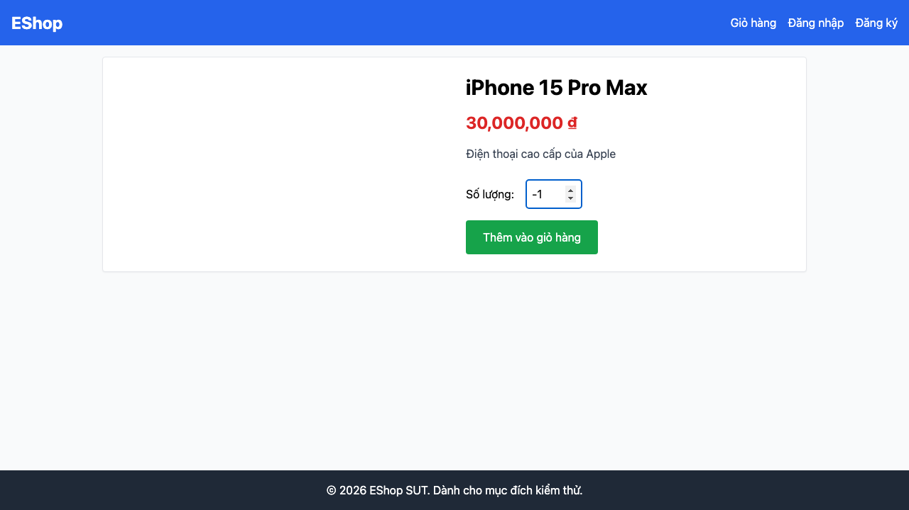

# GUI-IA02-09: Input số lượng có ràng buộc min/max, không cho giá trị vô lý

## Requirement ID
FR-22 (format constraints: quantity)

## Module / Test type / Technique
Biểu mẫu (Forms) / GUI/Usability / Checklist-based GUI Testing

## Checklist coverage
| Thuộc tính | Giá trị |
| :--- | :--- |
| Checklist ID | GUI-IA02-09 |
| Interface Aspect | Biểu mẫu (Forms) |
| Actor | Người dùng cuối (khách) |
| Goal | Input số lượng có ràng buộc min/max, không cho giá trị vô lý. |
| Screen(s) | Chi tiết SP |
| Checklist item | Input Số lượng có ràng buộc min/max (hiện không min — ProductDetail.jsx:57-62); thử 0, -1, trống, chữ. |
| Traced to | FR-22 (format constraints: quantity) |

## Preconditions
- SUT đang chạy (`run_servers.sh`); Frontend Web khách hàng tại `localhost:5173`, backend tại `localhost:3000`.

## Test data
| Tham số | Giá trị thử nghiệm |
| :--- | :--- |
| Actor | Người dùng cuối (khách) |
| Interface | Frontend Web (khách) — UI |
| Endpoint / UI flow | /product/:id |
| Input / Payload | 0 ; -1 ; (trống) ; "abc" |
| Fixture | Sản phẩm seed id=1 |

## Test steps
1. Mở `/product/1`.
2. Lần lượt đặt số lượng = 0, -1, để trống, gõ chữ rồi thêm vào giỏ.
3. Mở Giỏ hàng kiểm tra dòng vừa thêm.
4. Fail nếu giỏ nhận số lượng <1 hoặc NaN.

## Expected result
- Giá trị <1 hoặc rỗng bị chặn hoặc chuẩn hoá về 1.
- Không thêm được sản phẩm với số lượng NaN vào giỏ.

## Status / Related bugs
Failed — BUG-31 (https://github.com/trngnneee/eshop-sut/issues/224)

## Actual result
- Executed by: Đặng Trường Nguyên
- Execution date: 2026-07-25
- Execution interface: Frontend Web (khách) — kiểm thử thủ công trên trình duyệt Chrome
- Observed: Input số lượng không có ràng buộc min (min=null); nhập được giá trị "-1" (<1) — cho phép số lượng vô lý.
- Execution result: **Failed**
- Screenshot: 
