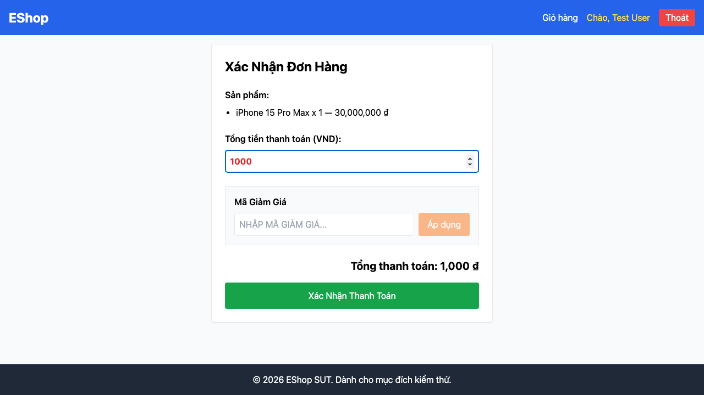

# GUI-IA02-10: Tổng tiền thanh toán là giá trị chỉ đọc, không sửa được

## Requirement ID
Heuristic (input constraint — nghiêm trọng)

## Module / Test type / Technique
Biểu mẫu (Forms) / GUI/Usability / Checklist-based GUI Testing

## Checklist coverage
| Thuộc tính | Giá trị |
| :--- | :--- |
| Checklist ID | GUI-IA02-10 |
| Interface Aspect | Biểu mẫu (Forms) |
| Actor | Người dùng cuối (khách) |
| Goal | Tổng tiền thanh toán là giá trị chỉ đọc, không sửa được. |
| Screen(s) | Thanh toán |
| Checklist item | Tổng tiền thanh toán là giá trị chỉ đọc (hiện là input number sửa được, gửi thẳng lên API — Checkout.jsx:94-103, 44-48). |
| Traced to | Heuristic (input constraint — nghiêm trọng) |

## Preconditions
- SUT đang chạy (`run_servers.sh`); Frontend Web khách hàng tại `localhost:5173`, backend tại `localhost:3000`.
- Đã đăng nhập bằng tài khoản `test@eshop.com` / `Test1234!`.
- Giỏ hàng có sẵn ít nhất 1 sản phẩm.

## Test data
| Tham số | Giá trị thử nghiệm |
| :--- | :--- |
| Actor | Người dùng cuối (khách) |
| Interface | Frontend Web (khách) — UI + Network tab |
| Endpoint / UI flow | /checkout |
| Input / Payload | Sửa tổng tiền thành 1000 |
| Fixture | Giỏ có sản phẩm; tài khoản test@eshop.com |

## Test steps
1. Thêm SP vào giỏ, đăng nhập, mở `/checkout`.
2. Sửa ô "Tổng tiền thanh toán" thành 1000, bấm Xác Nhận.
3. Xem payload `POST /api/checkout` ở Network tab.
4. Fail nếu số tiền sửa tay được gửi lên server.

## Expected result
- Người dùng không thể sửa tổng tiền trên UI.
- Sửa DOM/gõ giá trị khác không làm thay đổi số tiền gửi lên API.

## Status / Related bugs
Failed — xem screenshot & Issue liên quan

## Actual result
- Executed by: Đặng Trường Nguyên
- Execution date: 2026-07-25
- Execution interface: Frontend Web (khách) — Playwright/Chromium + Network
- Execution tool: Playwright (Chromium headless) — tự động hoá
- Observed: Ô "Tổng tiền thanh toán" là input number sửa được: đổi thành "1000" thành công → số tiền do người dùng nhập được gửi thẳng lên API /api/checkout (lỗi nghiêm trọng).
- Execution result: **Failed**
- Screenshot: 
