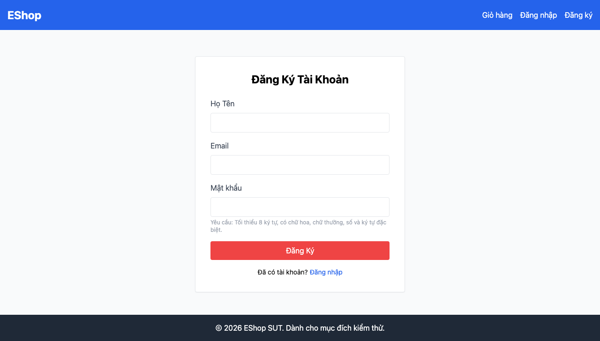

# GUI-IA02-14: Thông báo bắt buộc nhập nhất quán tiếng Việt

## Requirement ID
Heuristic (validation timing/consistency)

## Module / Test type / Technique
Biểu mẫu (Forms) / GUI/Usability / Checklist-based GUI Testing

## Checklist coverage
| Thuộc tính | Giá trị |
| :--- | :--- |
| Checklist ID | GUI-IA02-14 |
| Interface Aspect | Biểu mẫu (Forms) |
| Actor | Người dùng cuối (khách) |
| Goal | Thông báo bắt buộc nhập nhất quán tiếng Việt. |
| Screen(s) | Đăng ký, Đăng nhập, Quên MK |
| Checklist item | Thông báo bắt buộc nhập nhất quán tiếng Việt (hiện dựa HTML5 required native → tooltip theo ngôn ngữ trình duyệt, có thể tiếng Anh). |
| Traced to | Heuristic (validation timing/consistency) |

## Preconditions
- SUT đang chạy (`run_servers.sh`); Frontend Web khách hàng tại `localhost:5173`, backend tại `localhost:3000`.

## Test data
| Tham số | Giá trị thử nghiệm |
| :--- | :--- |
| Actor | Người dùng cuối (khách) |
| Interface | Frontend Web (khách) — UI |
| Endpoint / UI flow | /register , /login , /forgot-password |
| Input / Payload | Submit form khi để trống field bắt buộc |
| Fixture | Không cần |

## Test steps
1. Mở từng form, để trống field bắt buộc rồi submit.
2. Quan sát ngôn ngữ và kiểu thông báo required.
3. Fail nếu tooltip tiếng Anh của trình duyệt (vd "Please fill out this field").

## Expected result
- Submit form để trống → thông báo "bắt buộc nhập" bằng tiếng Việt.
- Thông báo cùng style với các lỗi khác của app.

## Status / Related bugs
Failed — BUG-33 (https://github.com/trngnneee/eshop-sut/issues/226)

## Actual result
- Executed by: Đặng Trường Nguyên
- Execution date: 2026-07-25
- Execution interface: Frontend Web (khách) — kiểm thử thủ công trên trình duyệt Chrome
- Observed: Thông báo required dựa vào HTML5 native → hiển thị theo ngôn ngữ trình duyệt: "Please fill out this field." (tiếng Anh), không nhất quán tiếng Việt với các lỗi khác của app.
- Execution result: **Failed**
- Screenshot: 
