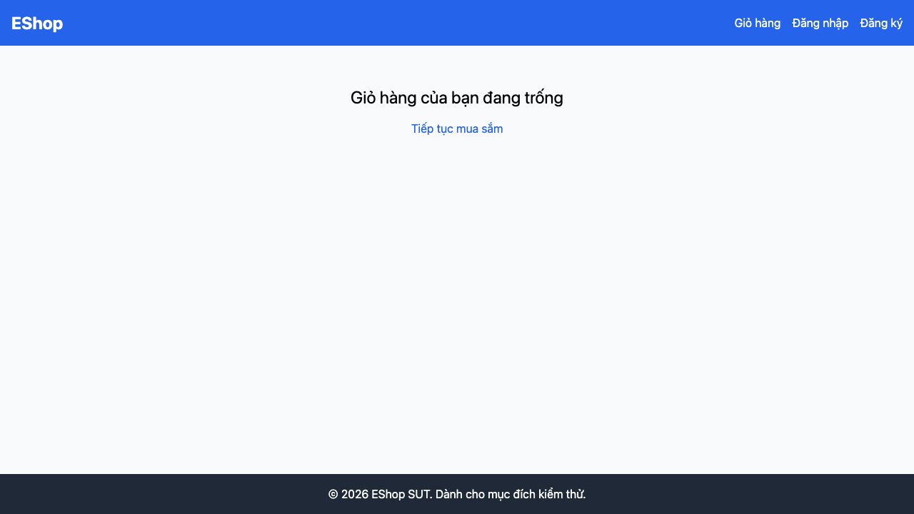

# GUI-IA03-01: Navbar highlight mục đang chọn

## Requirement ID
FR-23 (active highlight)

## Module / Test type / Technique
Điều hướng (Navigation) / GUI/Usability / Checklist-based GUI Testing

## Checklist coverage
| Thuộc tính | Giá trị |
| :--- | :--- |
| Checklist ID | GUI-IA03-01 |
| Interface Aspect | Điều hướng (Navigation) |
| Actor | Người dùng cuối (khách) |
| Goal | Navbar highlight mục đang chọn. |
| Screen(s) | Tất cả 8 màn hình (Header) |
| Checklist item | Navbar highlight mục đang chọn (hiện chỉ hover:underline — App.jsx:22-37). |
| Traced to | FR-23 (active highlight) |

## Preconditions
- SUT đang chạy (`run_servers.sh`); Frontend Web khách hàng tại `localhost:5173`, backend tại `localhost:3000`.

## Test data
| Tham số | Giá trị thử nghiệm |
| :--- | :--- |
| Actor | Người dùng cuối (khách) |
| Interface | Frontend Web (khách) — UI |
| Endpoint / UI flow | (mọi trang) |
| Input / Payload | Không có |
| Fixture | Không cần |

## Test steps
1. Điều hướng tới `/cart`.
2. Quan sát link "Giỏ hàng" trên header có style active không.
3. Fail nếu không phân biệt được link đang chọn.

## Expected result
- Link tương ứng trang hiện tại có style active (đậm/gạch chân/đổi màu) khác các link còn lại.

## Status / Related bugs
Failed — BUG-35 (https://github.com/trngnneee/eshop-sut/issues/228)

## Actual result
- Executed by: Đặng Trường Nguyên
- Execution date: 2026-07-25
- Execution interface: Frontend Web (khách) — kiểm thử thủ công trên trình duyệt Chrome
- Observed: Ở /cart, link "Giỏ hàng" trên navbar chỉ có class "hover:underline" (chỉ hover:underline), không có active-state (aria-current/đậm/đổi màu) để chỉ mục đang chọn.
- Execution result: **Failed**
- Screenshot: 
