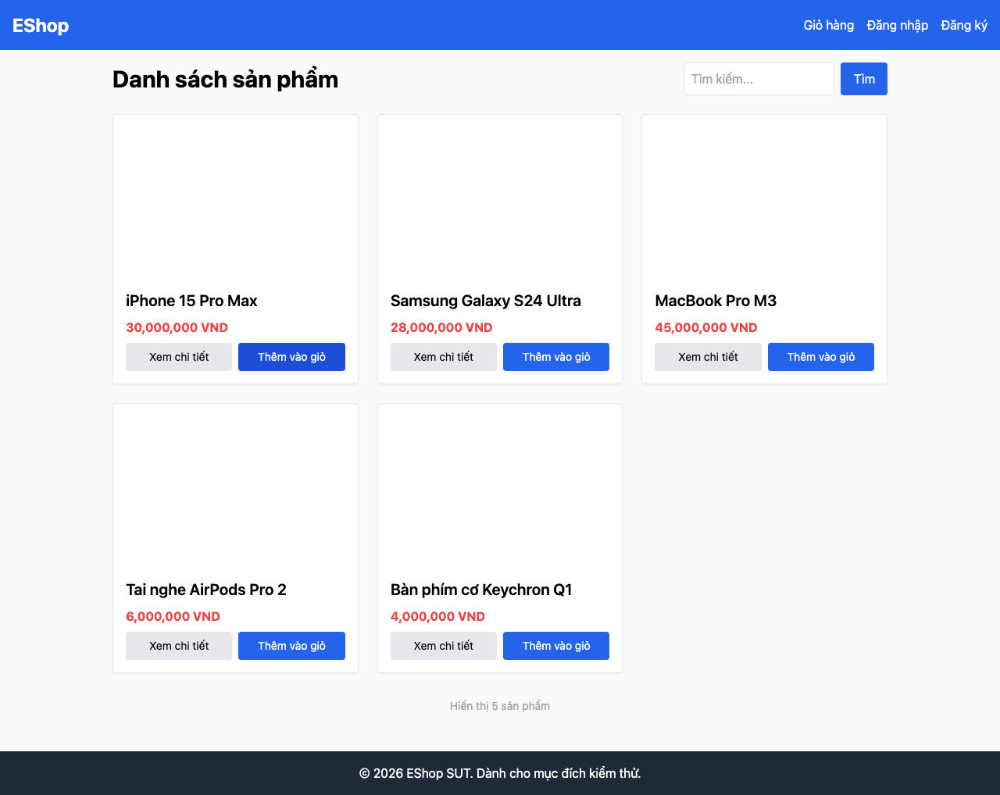

# GUI-IA03-02: Link Giỏ hàng có badge số lượng cập nhật realtime

## Requirement ID
FR-23 (badge/counter)

## Module / Test type / Technique
Điều hướng (Navigation) / GUI/Usability / Checklist-based GUI Testing

## Checklist coverage
| Thuộc tính | Giá trị |
| :--- | :--- |
| Checklist ID | GUI-IA03-02 |
| Interface Aspect | Điều hướng (Navigation) |
| Actor | Người dùng cuối (khách) |
| Goal | Link Giỏ hàng có badge số lượng cập nhật realtime. |
| Screen(s) | Tất cả 8 màn hình (Header) |
| Checklist item | Link "Giỏ hàng" có badge số lượng sản phẩm, cập nhật ngay khi thêm SP (hiện link trần — App.jsx:23). |
| Traced to | FR-23 (badge/counter) |

## Preconditions
- SUT đang chạy (`run_servers.sh`); Frontend Web khách hàng tại `localhost:5173`, backend tại `localhost:3000`.

## Test data
| Tham số | Giá trị thử nghiệm |
| :--- | :--- |
| Actor | Người dùng cuối (khách) |
| Interface | Frontend Web (khách) — UI |
| Endpoint / UI flow | (mọi trang) |
| Input / Payload | Thêm sản phẩm vào giỏ |
| Fixture | Sản phẩm seed id=1 |

## Test steps
1. Mở `/`, quan sát link "Giỏ hàng" trên header.
2. Bấm "Thêm vào giỏ" 1 sản phẩm, quan sát lại badge.
3. Fail nếu không có badge hoặc badge không cập nhật.

## Expected result
- Header hiển thị badge số lượng sản phẩm trong giỏ.
- Thêm 1 sản phẩm → badge tăng +1 tức thì.

## Status / Related bugs
Failed — xem screenshot & Issue liên quan

## Actual result
- Executed by: Đặng Trường Nguyên
- Execution date: 2026-07-25
- Execution interface: Frontend Web (khách) — Playwright/Chromium
- Execution tool: Playwright (Chromium headless) — tự động hoá
- Observed: Link "Giỏ hàng" là link trần, không có badge số lượng; sau khi thêm 1 SP header vẫn không hiển thị counter. Header: "EShop Giỏ hàng Đăng nhập Đăng ký".
- Execution result: **Failed**
- Screenshot: 
