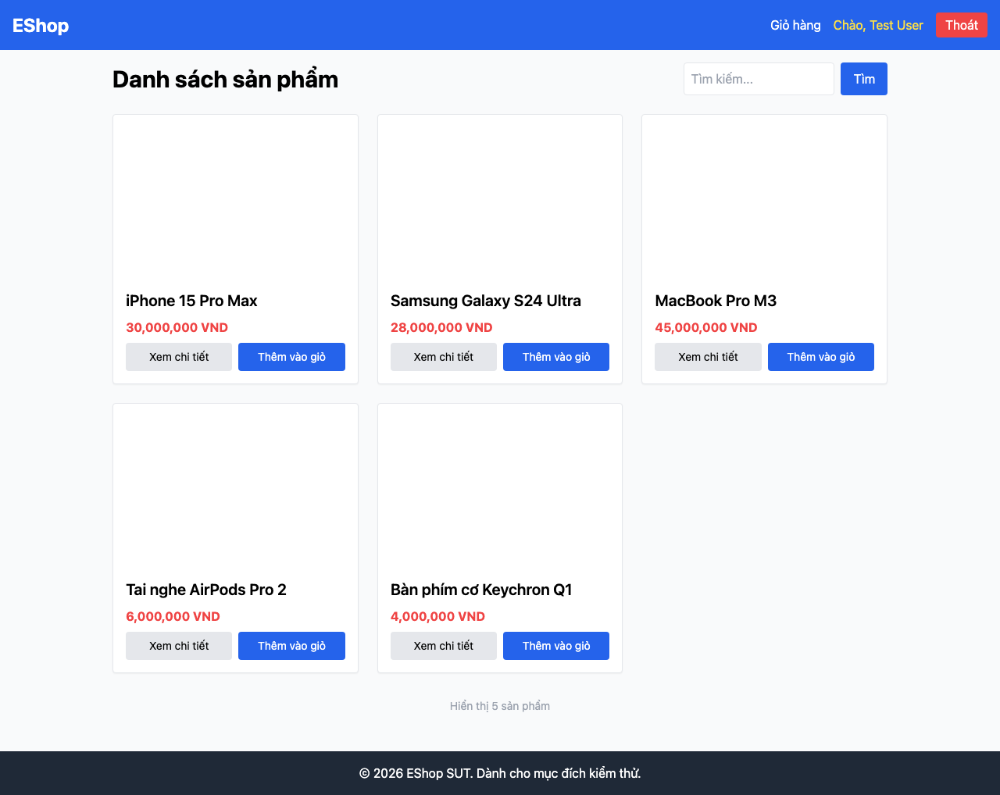

# GUI-IA03-03: Nút đăng xuất có nhãn chính xác "Đăng xuất"

## Requirement ID
FR-23 (exact label wording)

## Module / Test type / Technique
Điều hướng (Navigation) / GUI/Usability / Checklist-based GUI Testing

## Checklist coverage
| Thuộc tính | Giá trị |
| :--- | :--- |
| Checklist ID | GUI-IA03-03 |
| Interface Aspect | Điều hướng (Navigation) |
| Actor | Người dùng đã đăng nhập |
| Goal | Nút đăng xuất có nhãn chính xác "Đăng xuất". |
| Screen(s) | Header (đã đăng nhập) |
| Checklist item | Nút đăng xuất nhãn chính xác "Đăng xuất" (hiện ghi "Thoát" — App.jsx:29). |
| Traced to | FR-23 (exact label wording) |

## Preconditions
- SUT đang chạy (`run_servers.sh`); Frontend Web khách hàng tại `localhost:5173`, backend tại `localhost:3000`.
- Đã đăng nhập bằng tài khoản `test@eshop.com` / `Test1234!`.

## Test data
| Tham số | Giá trị thử nghiệm |
| :--- | :--- |
| Actor | Người dùng đã đăng nhập |
| Interface | Frontend Web (khách) — UI |
| Endpoint / UI flow | (mọi trang) |
| Input / Payload | Không có |
| Fixture | Tài khoản test@eshop.com |

## Test steps
1. Đăng nhập.
2. Quan sát nhãn nút đăng xuất trên header.
3. Fail nếu nhãn không đúng từng chữ "Đăng xuất".

## Expected result
- Nút trên header ghi đúng "Đăng xuất" (không phải "Thoát").

## Status / Related bugs
Failed — BUG-14 (https://github.com/trngnneee/eshop-sut/issues/207)

## Actual result
- Executed by: Đặng Trường Nguyên
- Execution date: 2026-07-25
- Execution interface: Frontend Web (khách) — kiểm thử thủ công trên trình duyệt Chrome
- Observed: Nút đăng xuất trên header ghi "Thoát" thay vì đúng nhãn "Đăng xuất" theo FR-23.
- Execution result: **Failed**
- Screenshot: 
