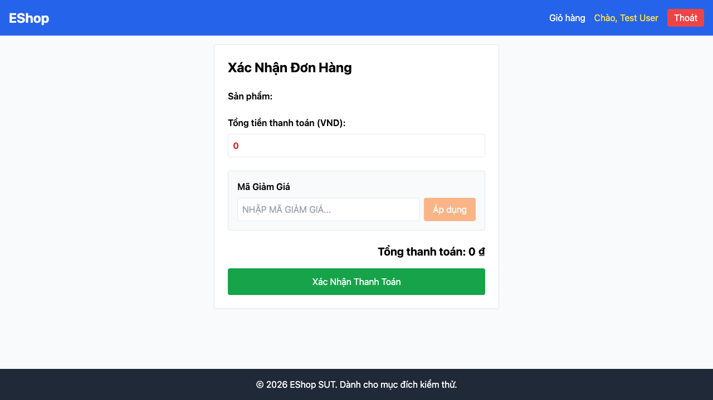

# GUI-IA03-04: Trang con có breadcrumb đúng cấp

## Requirement ID
FR-23 (breadcrumb)

## Module / Test type / Technique
Điều hướng (Navigation) / GUI/Usability / Checklist-based GUI Testing

## Checklist coverage
| Thuộc tính | Giá trị |
| :--- | :--- |
| Checklist ID | GUI-IA03-04 |
| Interface Aspect | Điều hướng (Navigation) |
| Actor | Người dùng cuối (khách) |
| Goal | Trang con có breadcrumb đúng cấp. |
| Screen(s) | Chi tiết SP, Giỏ hàng, Thanh toán |
| Checklist item | Có breadcrumb ở 3 trang con theo spec (hiện không có). |
| Traced to | FR-23 (breadcrumb) |

## Preconditions
- SUT đang chạy (`run_servers.sh`); Frontend Web khách hàng tại `localhost:5173`, backend tại `localhost:3000`.
- Đã đăng nhập bằng tài khoản `test@eshop.com` / `Test1234!`.
- Giỏ hàng có sẵn ít nhất 1 sản phẩm.

## Test data
| Tham số | Giá trị thử nghiệm |
| :--- | :--- |
| Actor | Người dùng cuối (khách) |
| Interface | Frontend Web (khách) — UI |
| Endpoint / UI flow | /product/:id , /cart , /checkout |
| Input / Payload | Không có |
| Fixture | Sản phẩm + giỏ có hàng |

## Test steps
1. Mở lần lượt Chi tiết SP, Giỏ hàng, Thanh toán.
2. Tìm breadcrumb ở đầu mỗi trang.
3. Fail nếu trang con nào thiếu breadcrumb.

## Expected result
- Mỗi trang con hiển thị breadcrumb đúng cấp (vd "Trang chủ > Giỏ hàng > Thanh toán").
- Các mục breadcrumb click được để quay lại.

## Status / Related bugs
Failed — BUG-36 (https://github.com/trngnneee/eshop-sut/issues/229)

## Actual result
- Executed by: Đặng Trường Nguyên
- Execution date: 2026-07-25
- Execution interface: Frontend Web (khách) — kiểm thử thủ công trên trình duyệt Chrome
- Observed: Các trang con thiếu breadcrumb: /product/1, /cart, /checkout — không có chỉ dẫn cấp điều hướng ("Trang chủ > ...").
- Execution result: **Failed**
- Screenshot: 
