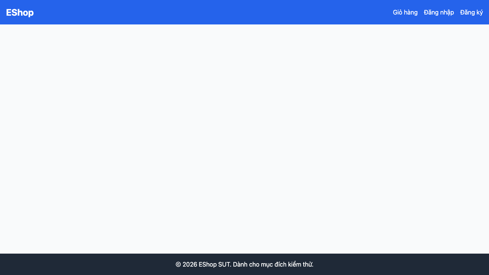

# GUI-IA03-05: URL không tồn tại hiển thị trang 404 thân thiện

## Requirement ID
Heuristic (invalid-URL/404)

## Module / Test type / Technique
Điều hướng (Navigation) / GUI/Usability / Checklist-based GUI Testing

## Checklist coverage
| Thuộc tính | Giá trị |
| :--- | :--- |
| Checklist ID | GUI-IA03-05 |
| Interface Aspect | Điều hướng (Navigation) |
| Actor | Người dùng cuối (khách) |
| Goal | URL không tồn tại hiển thị trang 404 thân thiện. |
| Screen(s) | Toàn app |
| Checklist item | URL không tồn tại (/abc) hiển thị trang 404 thân thiện (hiện không có route catch-all — App.jsx:50-59 → trang trắng). |
| Traced to | Heuristic (invalid-URL/404) |

## Preconditions
- SUT đang chạy (`run_servers.sh`); Frontend Web khách hàng tại `localhost:5173`, backend tại `localhost:3000`.

## Test data
| Tham số | Giá trị thử nghiệm |
| :--- | :--- |
| Actor | Người dùng cuối (khách) |
| Interface | Frontend Web (khách) — UI |
| Endpoint / UI flow | (mọi trang) |
| Input / Payload | URL `/abc`, `/admin` |
| Fixture | Không cần |

## Test steps
1. Truy cập `localhost:5173/abc`.
2. Quan sát nội dung hiển thị.
3. Fail nếu là trang trắng, không có 404.

## Expected result
- Truy cập `/abc` hiển thị trang 404 có message rõ ràng.
- Có link/nút quay về trang chủ, không phải trang trắng.

## Status / Related bugs
Failed — BUG-15 (https://github.com/trngnneee/eshop-sut/issues/208)

## Actual result
- Executed by: Đặng Trường Nguyên
- Execution date: 2026-07-25
- Execution interface: Frontend Web (khách) — kiểm thử thủ công trên trình duyệt Chrome
- Observed: URL không tồn tại /abc-khong-ton-tai render vùng nội dung trống ("") — không có route catch-all, không có trang 404 thân thiện.
- Execution result: **Failed**
- Screenshot: 
