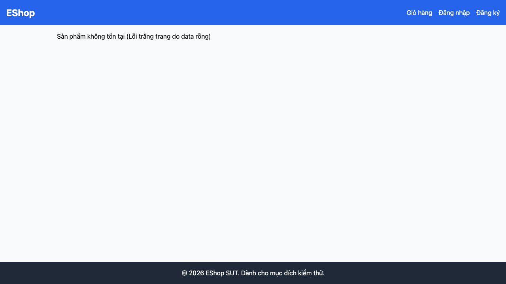

# GUI-IA03-06: Sản phẩm không tồn tại có thông báo thân thiện + đường quay về

## Requirement ID
Heuristic (not-found handling)

## Module / Test type / Technique
Điều hướng (Navigation) / GUI/Usability / Checklist-based GUI Testing

## Checklist coverage
| Thuộc tính | Giá trị |
| :--- | :--- |
| Checklist ID | GUI-IA03-06 |
| Interface Aspect | Điều hướng (Navigation) |
| Actor | Người dùng cuối (khách) |
| Goal | Sản phẩm không tồn tại có thông báo thân thiện + đường quay về. |
| Screen(s) | Chi tiết SP |
| Checklist item | /product/999 (không tồn tại) hiển thị thông báo thân thiện + đường quay về (hiện text kỹ thuật, không link — ProductDetail.jsx:35-36). |
| Traced to | Heuristic (not-found handling) |

## Preconditions
- SUT đang chạy (`run_servers.sh`); Frontend Web khách hàng tại `localhost:5173`, backend tại `localhost:3000`.

## Test data
| Tham số | Giá trị thử nghiệm |
| :--- | :--- |
| Actor | Người dùng cuối (khách) |
| Interface | Frontend Web (khách) — UI |
| Endpoint / UI flow | /product/:id |
| Input / Payload | URL `/product/999` |
| Fixture | ID sản phẩm không tồn tại |

## Test steps
1. Truy cập `/product/999`.
2. Quan sát nội dung và có đường quay về không.
3. Fail nếu chỉ có text kỹ thuật, không có link về trang chủ.

## Expected result
- Truy cập `/product/999` hiển thị message thân thiện.
- Có link/nút về trang chủ, không hiện text kỹ thuật "Lỗi trắng trang do data rỗng".

## Status / Related bugs
Failed — xem screenshot & Issue liên quan

## Actual result
- Executed by: Đặng Trường Nguyên
- Execution date: 2026-07-25
- Execution interface: Frontend Web (khách) — Playwright/Chromium
- Execution tool: Playwright (Chromium headless) — tự động hoá
- Observed: /product/999 hiển thị text kỹ thuật "Sản phẩm không tồn tại (Lỗi trắng trang do data rỗng)" và không có link quay về — không thân thiện, không lối thoát.
- Execution result: **Failed**
- Screenshot: 
