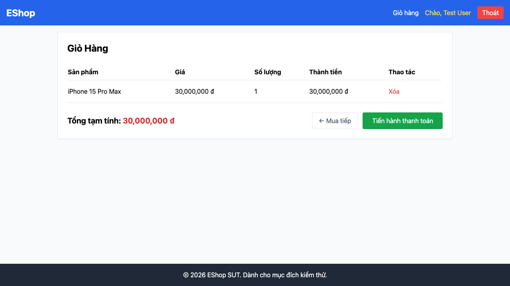

# GUI-IA03-08: Trang thanh toán có đường quay lại giỏ hàng

## Requirement ID
Heuristic (back/continue links)

## Module / Test type / Technique
Điều hướng (Navigation) / GUI/Usability / Checklist-based GUI Testing

## Checklist coverage
| Thuộc tính | Giá trị |
| :--- | :--- |
| Checklist ID | GUI-IA03-08 |
| Interface Aspect | Điều hướng (Navigation) |
| Actor | Người dùng cuối (khách) |
| Goal | Trang thanh toán có đường quay lại giỏ hàng. |
| Screen(s) | Thanh toán |
| Checklist item | Có link/nút quay lại Giỏ hàng trước khi xác nhận (hiện không có — Checkout.jsx:79-150). |
| Traced to | Heuristic (back/continue links) |

## Preconditions
- SUT đang chạy (`run_servers.sh`); Frontend Web khách hàng tại `localhost:5173`, backend tại `localhost:3000`.
- Đã đăng nhập bằng tài khoản `test@eshop.com` / `Test1234!`.
- Giỏ hàng có sẵn ít nhất 1 sản phẩm.

## Test data
| Tham số | Giá trị thử nghiệm |
| :--- | :--- |
| Actor | Người dùng cuối (khách) |
| Interface | Frontend Web (khách) — UI |
| Endpoint / UI flow | /checkout |
| Input / Payload | Không có |
| Fixture | Giỏ có hàng; tài khoản test@eshop.com |

## Test steps
1. Mở `/checkout` với giỏ có hàng.
2. Tìm link/nút quay lại giỏ hàng.
3. Fail nếu không có đường quay lại.

## Expected result
- Trang thanh toán có link/nút quay lại giỏ hàng.
- Quay lại không làm mất dữ liệu giỏ.

## Status / Related bugs
Failed — BUG-38 (https://github.com/trngnneee/eshop-sut/issues/231)

## Actual result
- Executed by: Đặng Trường Nguyên
- Execution date: 2026-07-25
- Execution interface: Frontend Web (khách) — kiểm thử thủ công trên trình duyệt Chrome
- Observed: Trang thanh toán không có link/nút quay lại Giỏ hàng trước khi xác nhận — người dùng bị cụt đường về để sửa giỏ.
- Execution result: **Failed**
- Screenshot: 
