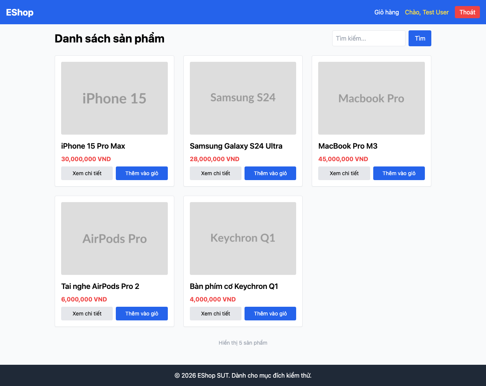

# GUI-IA03-09: Sau khi buộc đăng nhập, quay lại đúng ngữ cảnh (giỏ/checkout)

## Requirement ID
Heuristic (redirect flow)

## Module / Test type / Technique
Điều hướng (Navigation) / GUI/Usability / Checklist-based GUI Testing

## Checklist coverage
| Thuộc tính | Giá trị |
| :--- | :--- |
| Checklist ID | GUI-IA03-09 |
| Interface Aspect | Điều hướng (Navigation) |
| Actor | Người dùng cuối (khách) |
| Goal | Sau khi buộc đăng nhập, quay lại đúng ngữ cảnh (giỏ/checkout). |
| Screen(s) | Giỏ hàng → Đăng nhập |
| Checklist item | Bị chặn checkout vì chưa login → đăng nhập xong quay lại giỏ/checkout (hiện luôn về / — Login.jsx:16). |
| Traced to | Heuristic (redirect flow) |

## Preconditions
- SUT đang chạy (`run_servers.sh`); Frontend Web khách hàng tại `localhost:5173`, backend tại `localhost:3000`.
- Giỏ hàng có sẵn ít nhất 1 sản phẩm.

## Test data
| Tham số | Giá trị thử nghiệm |
| :--- | :--- |
| Actor | Người dùng cuối (khách) |
| Interface | Frontend Web (khách) — UI |
| Endpoint / UI flow | /cart → /login |
| Input / Payload | Tài khoản test@eshop.com |
| Fixture | Giỏ có hàng (chưa đăng nhập) |

## Test steps
1. Chưa đăng nhập, thêm SP vào giỏ, mở `/cart`, bấm "Tiến hành thanh toán".
2. Bị chuyển sang `/login`, đăng nhập.
3. Fail nếu sau đăng nhập bị đưa về `/` thay vì quay lại giỏ/checkout.

## Expected result
- Sau khi đăng nhập từ luồng checkout, người dùng quay lại giỏ hàng/checkout.
- Không bị đưa về trang chủ mất ngữ cảnh.

## Status / Related bugs
Failed — xem screenshot & Issue liên quan

## Actual result
- Executed by: Đặng Trường Nguyên
- Execution date: 2026-07-25
- Execution interface: Frontend Web (khách) — Playwright/Chromium
- Execution tool: Playwright (Chromium headless) — tự động hoá
- Observed: Sau khi buộc đăng nhập từ luồng checkout, người dùng bị đưa về "http://localhost:5173/" (trang chủ) thay vì quay lại giỏ/checkout — mất ngữ cảnh.
- Execution result: **Failed**
- Screenshot: 
