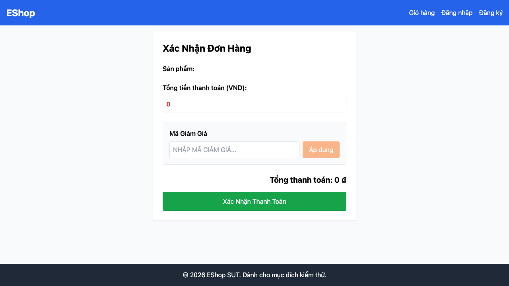

# GUI-IA03-12: Chặn vào thẳng /checkout khi giỏ trống hoặc chưa đăng nhập

## Requirement ID
Heuristic (route guarding)

## Module / Test type / Technique
Điều hướng (Navigation) / GUI/Usability / Checklist-based GUI Testing

## Checklist coverage
| Thuộc tính | Giá trị |
| :--- | :--- |
| Checklist ID | GUI-IA03-12 |
| Interface Aspect | Điều hướng (Navigation) |
| Actor | Người dùng cuối (khách) |
| Goal | Chặn vào thẳng /checkout khi giỏ trống hoặc chưa đăng nhập. |
| Screen(s) | Thanh toán |
| Checklist item | Vào thẳng /checkout khi giỏ trống/chưa login bị chặn (hiện không guard — form hiện tổng 0 ₫). |
| Traced to | Heuristic (route guarding) |

## Preconditions
- SUT đang chạy (`run_servers.sh`); Frontend Web khách hàng tại `localhost:5173`, backend tại `localhost:3000`.
- Đã đăng nhập bằng tài khoản `test@eshop.com` / `Test1234!`.
- Giỏ hàng có sẵn ít nhất 1 sản phẩm.

## Test data
| Tham số | Giá trị thử nghiệm |
| :--- | :--- |
| Actor | Người dùng cuối (khách) |
| Interface | Frontend Web (khách) — UI |
| Endpoint / UI flow | /checkout |
| Input / Payload | URL `/checkout` trực tiếp |
| Fixture | Không cần |

## Test steps
1. Khi giỏ trống và chưa đăng nhập, truy cập thẳng `/checkout`.
2. Quan sát có bị redirect hay hiển thị form.
3. Fail nếu form thanh toán hiện ra bình thường.

## Expected result
- Giỏ trống → redirect về giỏ hàng.
- Chưa đăng nhập → redirect về đăng nhập.
- Không hiển thị form thanh toán với tổng 0 ₫.

## Status / Related bugs
Failed — BUG-13 (https://github.com/trngnneee/eshop-sut/issues/206)

## Actual result
- Executed by: Đặng Trường Nguyên
- Execution date: 2026-07-25
- Execution interface: Frontend Web (khách) — kiểm thử thủ công trên trình duyệt Chrome
- Observed: Vào thẳng /checkout khi giỏ trống & chưa đăng nhập vẫn hiển thị form thanh toán (tổng 0 ₫), không bị redirect — thiếu route guard.
- Execution result: **Failed**
- Screenshot: 
