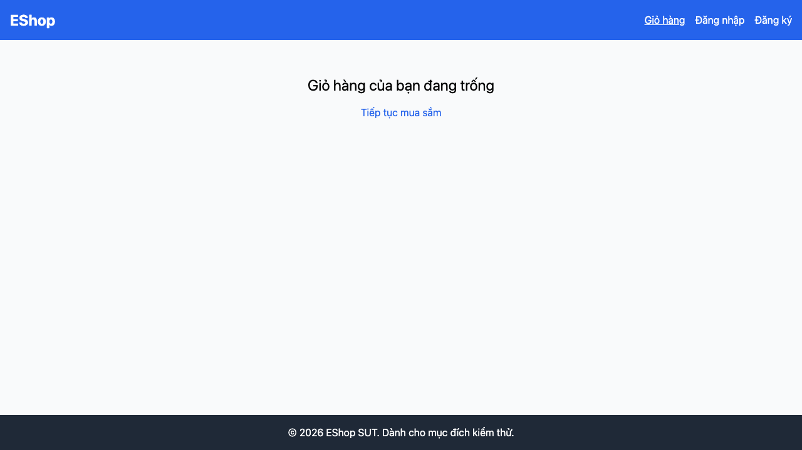

# GUI-GAP-01: Giỏ hàng được giữ lại sau khi refresh trang

## Requirement ID
Heuristic (state persistence) — bổ sung thủ công

## Module / Test type / Technique
Phản hồi & Trạng thái (Feedback & State) / GUI/Usability / Checklist-based GUI Testing

## Checklist coverage
| Thuộc tính | Giá trị |
| :--- | :--- |
| Checklist ID | GUI-GAP-01 |
| Interface Aspect | Phản hồi & Trạng thái (Feedback & State) |
| Actor | Người dùng cuối (khách) |
| Goal | Giỏ hàng được giữ lại sau khi refresh trang. |
| Screen(s) | Giỏ hàng (toàn app) |
| Checklist item | Giỏ hàng được giữ lại sau khi refresh (F5) trang (hiện chỉ trong React state — CartContext.jsx:6, trong khi token CÓ dùng localStorage). |
| Traced to | Heuristic (state persistence) — bổ sung thủ công |

## Preconditions
- SUT đang chạy (`run_servers.sh`); Frontend Web khách hàng tại `localhost:5173`, backend tại `localhost:3000`.
- Giỏ hàng có sẵn ít nhất 1 sản phẩm.

## Test data
| Tham số | Giá trị thử nghiệm |
| :--- | :--- |
| Actor | Người dùng cuối (khách) |
| Interface | Frontend Web (khách) — UI |
| Endpoint / UI flow | /cart |
| Input / Payload | Nhấn F5 sau khi thêm giỏ |
| Fixture | Sản phẩm seed id=1 |

## Test steps
1. Thêm 1 sản phẩm vào giỏ.
2. Nhấn F5 (reload) trang bất kỳ.
3. Mở `/cart`.
4. Fail nếu giỏ trống sau reload.

## Expected result
- Thêm SP vào giỏ, F5 ở bất kỳ trang nào → giỏ vẫn còn nguyên sản phẩm.

## Status / Related bugs
Failed — xem screenshot & Issue liên quan

## Actual result
- Executed by: Đặng Trường Nguyên
- Execution date: 2026-07-25
- Execution interface: Frontend Web (khách) — Playwright/Chromium
- Execution tool: Playwright (Chromium headless) — tự động hoá
- Observed: Thêm SP vào giỏ rồi F5 (reload) → giỏ trống (0 dòng). Giỏ chỉ nằm trong React state, không lưu localStorage (trong khi token thì có).
- Execution result: **Failed**
- Screenshot: 
