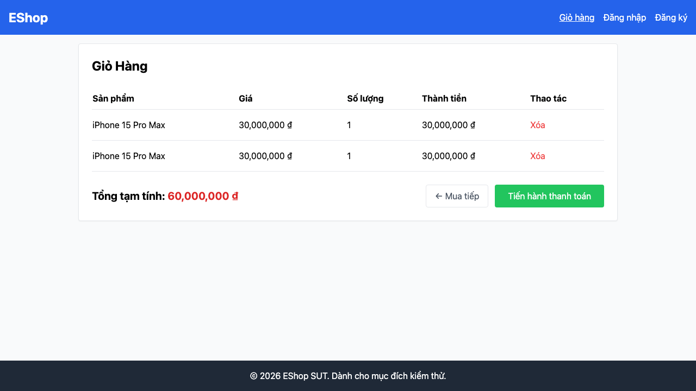

# GUI-GAP-02: Thêm cùng 1 SP nhiều lần gộp thành 1 dòng cộng dồn số lượng

## Requirement ID
Heuristic (cart merge) — bổ sung thủ công

## Module / Test type / Technique
Phản hồi & Trạng thái (Feedback & State) / GUI/Usability / Checklist-based GUI Testing

## Checklist coverage
| Thuộc tính | Giá trị |
| :--- | :--- |
| Checklist ID | GUI-GAP-02 |
| Interface Aspect | Phản hồi & Trạng thái (Feedback & State) |
| Actor | Người dùng cuối (khách) |
| Goal | Thêm cùng 1 SP nhiều lần gộp thành 1 dòng cộng dồn số lượng. |
| Screen(s) | Trang chủ, Giỏ hàng |
| Checklist item | Thêm cùng 1 SP nhiều lần → gộp 1 dòng với số lượng cộng dồn (hiện append thành dòng riêng — CartContext.jsx:8-10). |
| Traced to | Heuristic (cart merge) — bổ sung thủ công |

## Preconditions
- SUT đang chạy (`run_servers.sh`); Frontend Web khách hàng tại `localhost:5173`, backend tại `localhost:3000`.
- Giỏ hàng có sẵn ít nhất 1 sản phẩm.

## Test data
| Tham số | Giá trị thử nghiệm |
| :--- | :--- |
| Actor | Người dùng cuối (khách) |
| Interface | Frontend Web (khách) — UI |
| Endpoint / UI flow | / , /cart |
| Input / Payload | Thêm cùng 1 SP 2 lần |
| Fixture | Sản phẩm seed id=1 |

## Test steps
1. Mở `/`, bấm "Thêm vào giỏ" cùng 1 sản phẩm 2 lần.
2. Mở `/cart`.
3. Fail nếu hiện 2 dòng trùng tên thay vì 1 dòng số lượng 2.

## Expected result
- Thêm cùng 1 sản phẩm 2 lần → Giỏ hàng hiển thị 1 dòng, số lượng = 2.

## Status / Related bugs
Failed — BUG-47 (https://github.com/trngnneee/eshop-sut/issues/240)

## Actual result
- Executed by: Đặng Trường Nguyên
- Execution date: 2026-07-25
- Execution interface: Frontend Web (khách) — kiểm thử thủ công trên trình duyệt Chrome
- Observed: Thêm cùng 1 sản phẩm 2 lần tạo 2 dòng riêng trong giỏ thay vì gộp thành 1 dòng số lượng 2 (addToCart luôn push entry mới).
- Execution result: **Failed**
- Screenshot: 
