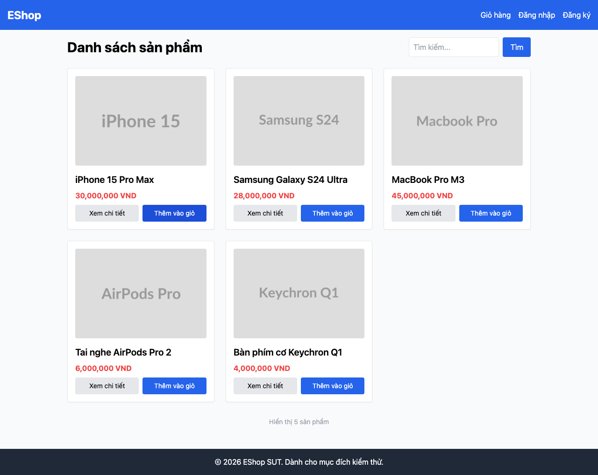

# GUI-IA04-01: Thêm vào giỏ có phản hồi trực quan ngay

## Requirement ID
FR-24 (add-to-cart feedback)

## Module / Test type / Technique
Phản hồi & Trạng thái (Feedback & State) / GUI/Usability / Checklist-based GUI Testing

## Checklist coverage
| Thuộc tính | Giá trị |
| :--- | :--- |
| Checklist ID | GUI-IA04-01 |
| Interface Aspect | Phản hồi & Trạng thái (Feedback & State) |
| Actor | Người dùng cuối (khách) |
| Goal | Thêm vào giỏ có phản hồi trực quan ngay. |
| Screen(s) | Trang chủ |
| Checklist item | "Thêm vào giỏ" có phản hồi trực quan ngay (hiện không có gì — Home.jsx:98-103). |
| Traced to | FR-24 (add-to-cart feedback) |

## Preconditions
- SUT đang chạy (`run_servers.sh`); Frontend Web khách hàng tại `localhost:5173`, backend tại `localhost:3000`.

## Test data
| Tham số | Giá trị thử nghiệm |
| :--- | :--- |
| Actor | Người dùng cuối (khách) |
| Interface | Frontend Web (khách) — UI |
| Endpoint / UI flow | / |
| Input / Payload | Click "Thêm vào giỏ" |
| Fixture | Sản phẩm seed id=1 |

## Test steps
1. Mở `/`.
2. Bấm "Thêm vào giỏ" trên 1 card.
3. Fail nếu không có phản hồi trực quan nào (không toast, không badge).

## Expected result
- Bấm "Thêm vào giỏ" trên card → có toast hoặc badge cập nhật ngay.

## Status / Related bugs
Failed — xem screenshot & Issue liên quan

## Actual result
- Executed by: Đặng Trường Nguyên
- Execution date: 2026-07-25
- Execution interface: Frontend Web (khách) — Playwright/Chromium
- Execution tool: Playwright (Chromium headless) — tự động hoá
- Observed: Bấm "Thêm vào giỏ" ở trang chủ không có phản hồi trực quan nào (không toast, không badge cập nhật trên header).
- Execution result: **Failed**
- Screenshot: 
