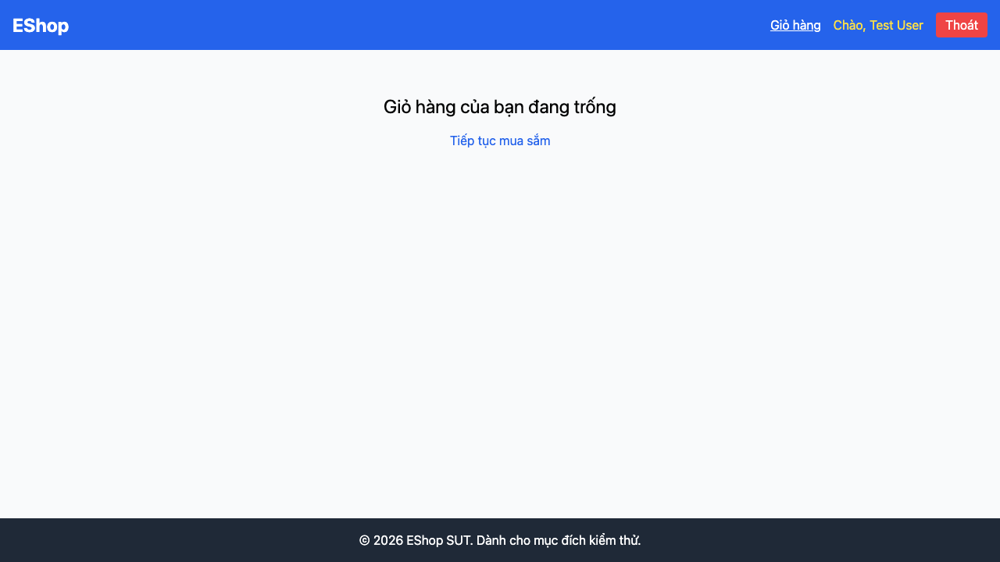

# GUI-IA04-02: Mỗi click thêm giỏ đều có tác dụng + feedback từ lần đầu

## Requirement ID
FR-24 (add-to-cart feedback)

## Module / Test type / Technique
Phản hồi & Trạng thái (Feedback & State) / GUI/Usability / Checklist-based GUI Testing

## Checklist coverage
| Thuộc tính | Giá trị |
| :--- | :--- |
| Checklist ID | GUI-IA04-02 |
| Interface Aspect | Phản hồi & Trạng thái (Feedback & State) |
| Actor | Người dùng cuối (khách) |
| Goal | Mỗi click thêm giỏ đều có tác dụng + feedback từ lần đầu. |
| Screen(s) | Chi tiết SP |
| Checklist item | MỖI click "Thêm vào giỏ hàng" đều thêm SP + feedback từ lần đầu (hiện click đầu bị nuốt — ProductDetail.jsx:22-32). |
| Traced to | FR-24 (add-to-cart feedback) |

## Preconditions
- SUT đang chạy (`run_servers.sh`); Frontend Web khách hàng tại `localhost:5173`, backend tại `localhost:3000`.

## Test data
| Tham số | Giá trị thử nghiệm |
| :--- | :--- |
| Actor | Người dùng cuối (khách) |
| Interface | Frontend Web (khách) — UI |
| Endpoint / UI flow | /product/:id |
| Input / Payload | Click "Thêm vào giỏ hàng" 1 lần |
| Fixture | Sản phẩm seed id=1 |

## Test steps
1. Mở `/product/1`.
2. Bấm "Thêm vào giỏ hàng" đúng 1 lần.
3. Mở giỏ kiểm tra sản phẩm.
4. Fail nếu lần bấm đầu không thêm được/không có feedback.

## Expected result
- Click 1 lần → sản phẩm vào giỏ ngay + hiện "Đã thêm".
- Không có click nào bị bỏ qua.

## Status / Related bugs
Failed — BUG-17 (https://github.com/trngnneee/eshop-sut/issues/210)

## Actual result
- Executed by: Đặng Trường Nguyên
- Execution date: 2026-07-25
- Execution interface: Frontend Web (khách) — kiểm thử thủ công trên trình duyệt Chrome
- Observed: Click "Thêm vào giỏ hàng" lần đầu bị "nuốt" (clickCount): không có feedback "Đã thêm" và giỏ vẫn trống (0 dòng) — mất 1 lần thao tác.
- Execution result: **Failed**
- Screenshot: 
