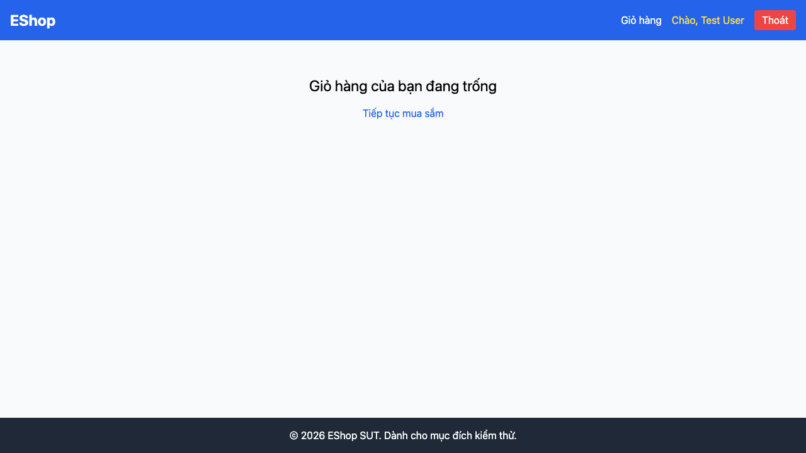

# GUI-IA04-03: Xoá item giỏ có dialog xác nhận

## Requirement ID
FR-24 (confirmation dialog)

## Module / Test type / Technique
Phản hồi & Trạng thái (Feedback & State) / GUI/Usability / Checklist-based GUI Testing

## Checklist coverage
| Thuộc tính | Giá trị |
| :--- | :--- |
| Checklist ID | GUI-IA04-03 |
| Interface Aspect | Phản hồi & Trạng thái (Feedback & State) |
| Actor | Người dùng cuối (khách) |
| Goal | Xoá item giỏ có dialog xác nhận. |
| Screen(s) | Giỏ hàng |
| Checklist item | "Xóa" item có dialog xác nhận (hiện xoá ngay — Cart.jsx:50-55). |
| Traced to | FR-24 (confirmation dialog) |

## Preconditions
- SUT đang chạy (`run_servers.sh`); Frontend Web khách hàng tại `localhost:5173`, backend tại `localhost:3000`.
- Giỏ hàng có sẵn ít nhất 1 sản phẩm.

## Test data
| Tham số | Giá trị thử nghiệm |
| :--- | :--- |
| Actor | Người dùng cuối (khách) |
| Interface | Frontend Web (khách) — UI |
| Endpoint / UI flow | /cart |
| Input / Payload | Click "Xóa" |
| Fixture | Giỏ có ≥1 sản phẩm |

## Test steps
1. Mở `/cart` với giỏ có hàng.
2. Bấm "Xóa" một item.
3. Fail nếu item bị xoá ngay không có dialog xác nhận.

## Expected result
- Bấm "Xóa" hiển thị dialog xác nhận với 2 lựa chọn.
- Chọn Hủy → item được giữ nguyên.

## Status / Related bugs
Failed — xem screenshot & Issue liên quan

## Actual result
- Executed by: Đặng Trường Nguyên
- Execution date: 2026-07-25
- Execution interface: Frontend Web (khách) — Playwright/Chromium
- Execution tool: Playwright (Chromium headless) — tự động hoá
- Observed: Bấm "Xóa" item xoá ngay (dòng giỏ 1→0) không có dialog xác nhận — thao tác phá huỷ không có bước chặn.
- Execution result: **Failed**
- Screenshot: 
