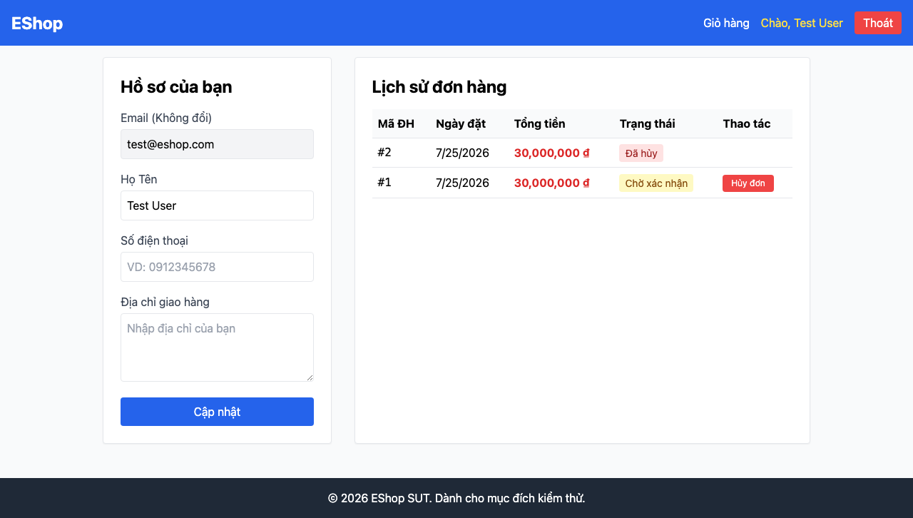

# GUI-IA04-04: Hủy đơn có dialog xác nhận trước hành động không hoàn tác

## Requirement ID
FR-24 (confirmation dialog)

## Module / Test type / Technique
Phản hồi & Trạng thái (Feedback & State) / GUI/Usability / Checklist-based GUI Testing

## Checklist coverage
| Thuộc tính | Giá trị |
| :--- | :--- |
| Checklist ID | GUI-IA04-04 |
| Interface Aspect | Phản hồi & Trạng thái (Feedback & State) |
| Actor | Người dùng đã đăng nhập |
| Goal | Hủy đơn có dialog xác nhận trước hành động không hoàn tác. |
| Screen(s) | Lịch sử ĐH |
| Checklist item | "Hủy đơn" có dialog xác nhận (hiện huỷ ngay; nút hiện cả khi "Đang giao" — Profile.jsx:200-208). |
| Traced to | FR-24 (confirmation dialog) |

## Preconditions
- SUT đang chạy (`run_servers.sh`); Frontend Web khách hàng tại `localhost:5173`, backend tại `localhost:3000`.
- Đã đăng nhập bằng tài khoản `test@eshop.com` / `Test1234!`.

## Test data
| Tham số | Giá trị thử nghiệm |
| :--- | :--- |
| Actor | Người dùng đã đăng nhập |
| Interface | Frontend Web (khách) — UI |
| Endpoint / UI flow | /profile |
| Input / Payload | Click "Hủy đơn" |
| Fixture | Đơn hàng đang pending/confirmed của test@eshop.com |

## Test steps
1. Đăng nhập, mở `/profile`.
2. Bấm "Hủy đơn" một đơn chưa giao.
3. Fail nếu đơn bị huỷ ngay không có dialog xác nhận.

## Expected result
- Bấm "Hủy đơn" hiển thị dialog xác nhận.
- Chọn Hủy bỏ → đơn giữ nguyên trạng thái.

## Status / Related bugs
Failed — BUG-18 (https://github.com/trngnneee/eshop-sut/issues/211)

## Actual result
- Executed by: Đặng Trường Nguyên
- Execution date: 2026-07-25
- Execution interface: Frontend Web (khách) — kiểm thử thủ công trên trình duyệt Chrome
- Observed: Bấm "Hủy đơn" huỷ ngay, không có dialog xác nhận trước hành động không hoàn tác (chỉ có alert "Hủy đơn thành công" sau khi đã huỷ).
- Execution result: **Failed**
- Screenshot: 
