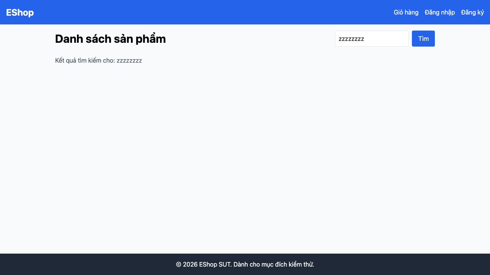

# GUI-IA04-06: Tìm kiếm 0 kết quả có empty state

## Requirement ID
FR-24 (empty-state visuals)

## Module / Test type / Technique
Phản hồi & Trạng thái (Feedback & State) / GUI/Usability / Checklist-based GUI Testing

## Checklist coverage
| Thuộc tính | Giá trị |
| :--- | :--- |
| Checklist ID | GUI-IA04-06 |
| Interface Aspect | Phản hồi & Trạng thái (Feedback & State) |
| Actor | Người dùng cuối (khách) |
| Goal | Tìm kiếm 0 kết quả có empty state. |
| Screen(s) | Trang chủ |
| Checklist item | Tìm kiếm 0 kết quả có empty state (hiện không có gì — Home.jsx:75-114). |
| Traced to | FR-24 (empty-state visuals) |

## Preconditions
- SUT đang chạy (`run_servers.sh`); Frontend Web khách hàng tại `localhost:5173`, backend tại `localhost:3000`.

## Test data
| Tham số | Giá trị thử nghiệm |
| :--- | :--- |
| Actor | Người dùng cuối (khách) |
| Interface | Frontend Web (khách) — UI |
| Endpoint / UI flow | / |
| Input / Payload | Từ khoá "zzzzzz" |
| Fixture | Sản phẩm seed |

## Test steps
1. Mở `/`, tìm với từ khoá không tồn tại (vd "zzzzzz").
2. Quan sát vùng kết quả.
3. Fail nếu trang trống trơn, không có thông báo empty.

## Expected result
- Tìm từ khoá không khớp → hiển thị "Không tìm thấy sản phẩm cho '<từ khoá>'" + icon.

## Status / Related bugs
Failed — BUG-42 (https://github.com/trngnneee/eshop-sut/issues/235)

## Actual result
- Executed by: Đặng Trường Nguyên
- Execution date: 2026-07-25
- Execution interface: Frontend Web (khách) — kiểm thử thủ công trên trình duyệt Chrome
- Observed: Tìm từ khoá không tồn tại ("zzzzzzzz") cho grid trống hoàn toàn, không có empty-state ("Không tìm thấy sản phẩm...").
- Execution result: **Failed**
- Screenshot: 
