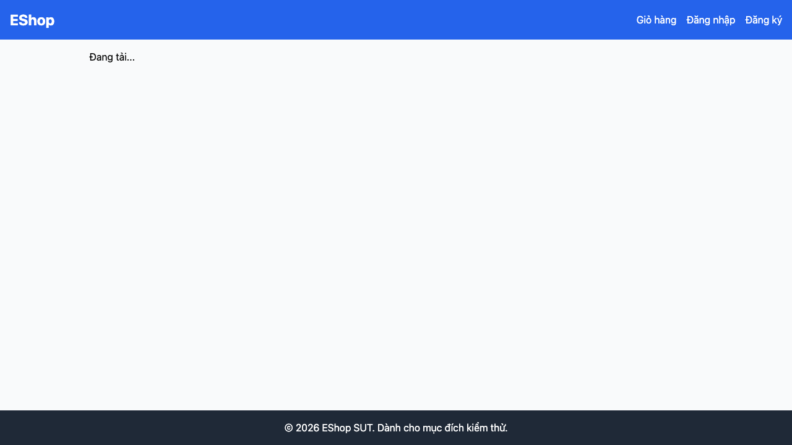

# GUI-IA04-09: API lỗi hiển thị error state, không kẹt loading vô hạn

## Requirement ID
Heuristic (error state)

## Module / Test type / Technique
Phản hồi & Trạng thái (Feedback & State) / GUI/Usability / Checklist-based GUI Testing

## Checklist coverage
| Thuộc tính | Giá trị |
| :--- | :--- |
| Checklist ID | GUI-IA04-09 |
| Interface Aspect | Phản hồi & Trạng thái (Feedback & State) |
| Actor | Người dùng cuối (khách) |
| Goal | API lỗi hiển thị error state, không kẹt loading vô hạn. |
| Screen(s) | Chi tiết SP |
| Checklist item | API lỗi/backend chết → error state, không kẹt "Đang tải..." vô hạn (ProductDetail.jsx:15-20). |
| Traced to | Heuristic (error state) |

## Preconditions
- SUT đang chạy (`run_servers.sh`); Frontend Web khách hàng tại `localhost:5173`, backend tại `localhost:3000`.

## Test data
| Tham số | Giá trị thử nghiệm |
| :--- | :--- |
| Actor | Người dùng cuối (khách) |
| Interface | Frontend Web (khách) — tắt backend / block request |
| Endpoint / UI flow | /product/:id |
| Input / Payload | Tắt backend hoặc block API |
| Fixture | Sản phẩm seed id=1 |

## Test steps
1. Tắt backend (hoặc block `/api/products/1`).
2. Mở `/product/1`.
3. Fail nếu trang kẹt "Đang tải..." không có error state.

## Expected result
- Khi backend không phản hồi, trang hiển thị message lỗi + nút thử lại/về trang chủ.
- Không kẹt mãi ở "Đang tải...".

## Status / Related bugs
Failed — BUG-19 (https://github.com/trngnneee/eshop-sut/issues/212)

## Actual result
- Executed by: Đặng Trường Nguyên
- Execution date: 2026-07-25
- Execution interface: Frontend Web (khách) — kiểm thử thủ công trên trình duyệt Chrome (block API)
- Observed: Khi API sản phẩm lỗi, trang kẹt ở "Đang tải..." (không có error state / nút thử lại) — chỉ log console, kẹt "Đang tải..." vô hạn.
- Execution result: **Failed**
- Screenshot: 
