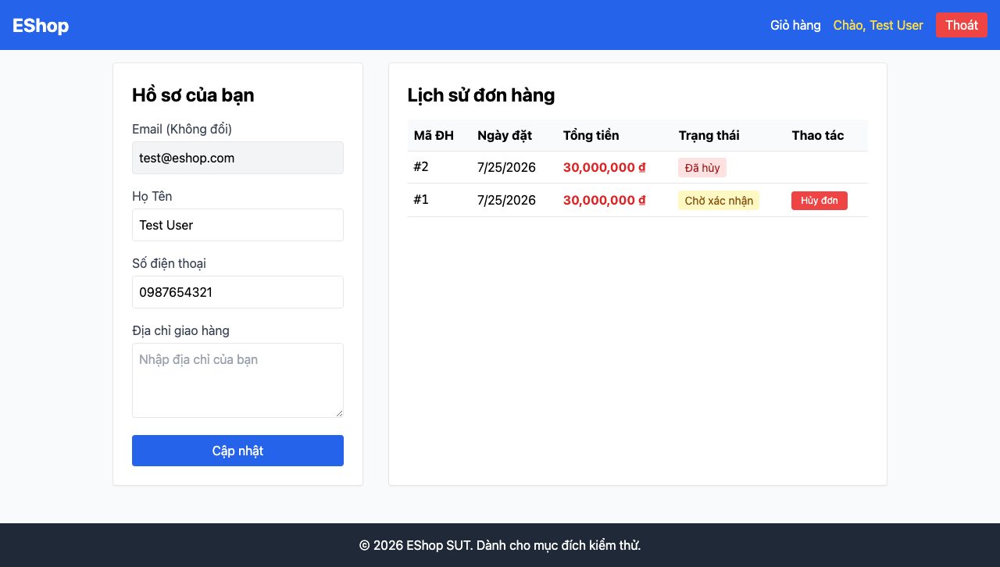

# GUI-IA04-10: Feedback thành công/lỗi API dùng UI trong trang, không alert() native

## Requirement ID
Heuristic (toast consistency)

## Module / Test type / Technique
Phản hồi & Trạng thái (Feedback & State) / GUI/Usability / Checklist-based GUI Testing

## Checklist coverage
| Thuộc tính | Giá trị |
| :--- | :--- |
| Checklist ID | GUI-IA04-10 |
| Interface Aspect | Phản hồi & Trạng thái (Feedback & State) |
| Actor | Người dùng cuối (khách) |
| Goal | Feedback thành công/lỗi API dùng UI trong trang, không alert() native. |
| Screen(s) | Quên MK, Hồ sơ, Giỏ hàng, Thanh toán |
| Checklist item | Feedback thành công/lỗi API dùng UI trong trang nhất quán, không alert() native (hiện 8+ chỗ alert). Lỗi validate đã cover ở GUI-IA02-04. |
| Traced to | Heuristic (toast consistency) |

## Preconditions
- SUT đang chạy (`run_servers.sh`); Frontend Web khách hàng tại `localhost:5173`, backend tại `localhost:3000`.
- Đã đăng nhập bằng tài khoản `test@eshop.com` / `Test1234!`.
- Giỏ hàng có sẵn ít nhất 1 sản phẩm.

## Test data
| Tham số | Giá trị thử nghiệm |
| :--- | :--- |
| Actor | Người dùng cuối (khách) |
| Interface | Frontend Web (khách) — UI |
| Endpoint / UI flow | /forgot-password , /profile , /cart , /checkout |
| Input / Payload | Các thao tác gây feedback (cập nhật hồ sơ, checkout, huỷ đơn...) |
| Fixture | Tài khoản test@eshop.com |

## Test steps
1. Thực hiện các thao tác có feedback trên 4 màn hình (cập nhật hồ sơ, thanh toán, ...).
2. Ghi lại chỗ nào dùng alert() native.
3. Fail cho từng feedback dùng alert() thay vì UI trong trang.

## Expected result
- Mọi feedback thành công/lỗi API dùng một pattern in-page thống nhất.
- Không dùng `alert()` native.

## Status / Related bugs
Failed — xem screenshot & Issue liên quan

## Actual result
- Executed by: Đặng Trường Nguyên
- Execution date: 2026-07-25
- Execution interface: Frontend Web (khách) — Playwright/Chromium
- Execution tool: Playwright (Chromium headless) — tự động hoá
- Observed: Feedback cập nhật hồ sơ dùng alert() native (đã bắt được dialog alert) thay vì toast/thông báo trong trang — không nhất quán, còn 8+ chỗ dùng alert.
- Execution result: **Failed**
- Screenshot: 
