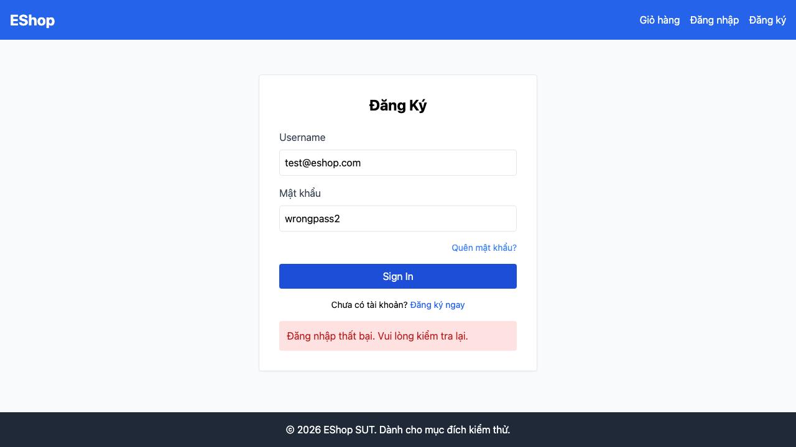

# GUI-IA04-11: UI báo rõ tài khoản bị khoá sau 3 lần sai

## Requirement ID
FR-24 + FR-02 (account-lockout messaging)

## Module / Test type / Technique
Phản hồi & Trạng thái (Feedback & State) / GUI/Usability / Checklist-based GUI Testing

## Checklist coverage
| Thuộc tính | Giá trị |
| :--- | :--- |
| Checklist ID | GUI-IA04-11 |
| Interface Aspect | Phản hồi & Trạng thái (Feedback & State) |
| Actor | Người dùng cuối (khách) |
| Goal | UI báo rõ tài khoản bị khoá sau 3 lần sai. |
| Screen(s) | Đăng nhập |
| Checklist item | Sau 3 lần sai, UI báo rõ tài khoản khoá 30s (hiện message chung — Login.jsx:17-19). |
| Traced to | FR-24 + FR-02 (account-lockout messaging) |

## Preconditions
- SUT đang chạy (`run_servers.sh`); Frontend Web khách hàng tại `localhost:5173`, backend tại `localhost:3000`.

## Test data
| Tham số | Giá trị thử nghiệm |
| :--- | :--- |
| Actor | Người dùng cuối (khách) |
| Interface | Frontend Web (khách) — UI |
| Endpoint / UI flow | /login |
| Input / Payload | Đăng nhập sai 3 lần liên tiếp |
| Fixture | Tài khoản test@eshop.com |

## Test steps
1. Mở `/login`, nhập sai mật khẩu 3 lần liên tiếp.
2. Thử lần 4, quan sát thông báo.
3. Fail nếu message giống hệt lần sai thường, không nói tài khoản bị khoá.

## Expected result
- Sau 3 lần nhập sai, UI thông báo tài khoản bị khoá (kèm thời gian 30 giây).
- Message phân biệt "sai mật khẩu" và "đang bị khoá".

## Status / Related bugs
Failed — xem screenshot & Issue liên quan

## Actual result
- Executed by: Đặng Trường Nguyên
- Execution date: 2026-07-25
- Execution interface: Frontend Web (khách) — Playwright/Chromium
- Execution tool: Playwright (Chromium headless) — tự động hoá
- Observed: Sau 3 lần đăng nhập sai (tài khoản đã bị backend khoá), UI vẫn hiện message chung "Đăng nhập thất bại. Vui lòng kiểm tra lại." — không phân biệt "sai mật khẩu" với "đang bị khoá", không nói thời gian mở khoá.
- Execution result: **Failed**
- Screenshot: 
