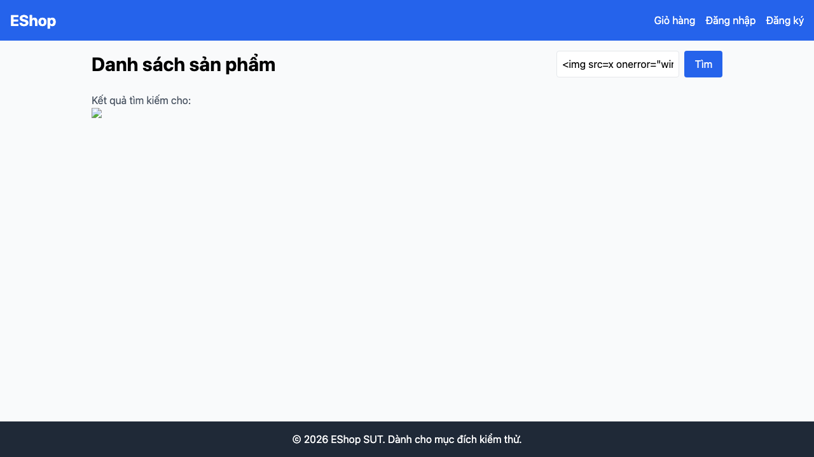

# GUI-IA04-13: Text người dùng nhập được render an toàn (chống XSS/HTML injection)

## Requirement ID
FR-24 + README mục 1 (safe rendering)

## Module / Test type / Technique
Phản hồi & Trạng thái (Feedback & State) / GUI/Usability / Checklist-based GUI Testing

## Checklist coverage
| Thuộc tính | Giá trị |
| :--- | :--- |
| Checklist ID | GUI-IA04-13 |
| Interface Aspect | Phản hồi & Trạng thái (Feedback & State) |
| Actor | Người dùng cuối (khách) |
| Goal | Text người dùng nhập được render an toàn (chống XSS/HTML injection). |
| Screen(s) | Trang chủ, Header, Hồ sơ |
| Checklist item | Text người dùng nhập được render an toàn tại cả 3 điểm: từ khoá tìm kiếm echo (Home.jsx:62-67), tên user header (App.jsx:26-28), địa chỉ giao hàng (Profile). Test với `` và ``. |
| Traced to | FR-24 + README mục 1 (safe rendering) |

## Preconditions
- SUT đang chạy (`run_servers.sh`); Frontend Web khách hàng tại `localhost:5173`, backend tại `localhost:3000`.

## Test data
| Tham số | Giá trị thử nghiệm |
| :--- | :--- |
| Actor | Người dùng cuối (khách) |
| Interface | Frontend Web (khách) — UI |
| Endpoint / UI flow | /, header, /profile |
| Input / Payload | `` ; `` |
| Fixture | Tài khoản test@eshop.com |

## Test steps
1. Nhập payload vào ô tìm kiếm ở `/` và quan sát dòng "Kết quả tìm kiếm cho".
2. Đăng ký/đổi tên user chứa payload, xem header "Chào, {name}".
3. Lưu địa chỉ giao hàng chứa payload ở `/profile`, reload.
4. Fail nếu bất kỳ điểm nào thực thi HTML/JS.

## Expected result
- Cả 3 điểm hiển thị text thuần, không thực thi HTML/JS.
- Điểm nào render/thực thi HTML → Fail và ghi rõ ở Notes.

## Status / Related bugs
Failed — xem screenshot & Issue liên quan

## Actual result
- Executed by: Đặng Trường Nguyên
- Execution date: 2026-07-25
- Execution interface: Frontend Web (khách) — Playwright/Chromium
- Execution tool: Playwright (Chromium headless) — tự động hoá
- Observed: Từ khoá tìm kiếm được render bằng dangerouslySetInnerHTML: payload "" THỰC THI JS (window.__xss=1) — lỗ hổng XSS. Tên user ở header cũng render tương tự.
- Execution result: **Failed**
- Screenshot: 
