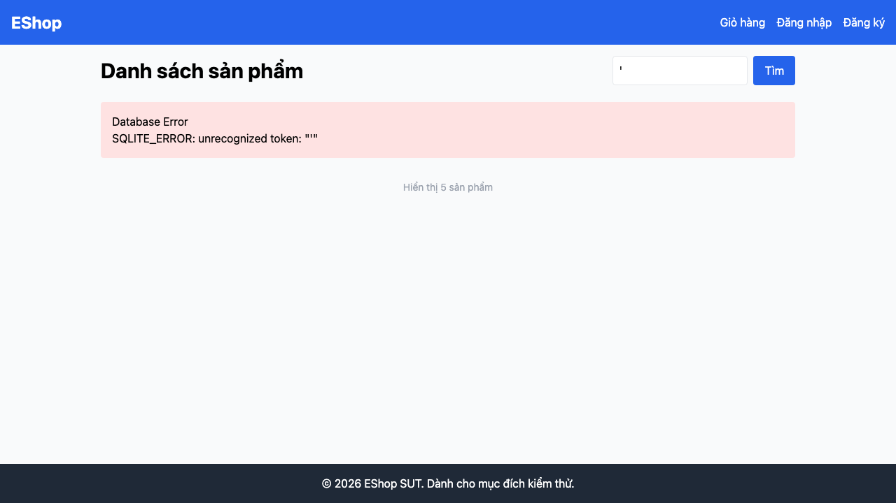

# GUI-IA04-14: Lỗi backend hiển thị thân thiện, không lộ chi tiết kỹ thuật

## Requirement ID
Heuristic (error feedback)

## Module / Test type / Technique
Phản hồi & Trạng thái (Feedback & State) / GUI/Usability / Checklist-based GUI Testing

## Checklist coverage
| Thuộc tính | Giá trị |
| :--- | :--- |
| Checklist ID | GUI-IA04-14 |
| Interface Aspect | Phản hồi & Trạng thái (Feedback & State) |
| Actor | Người dùng cuối (khách) |
| Goal | Lỗi backend hiển thị thân thiện, không lộ chi tiết kỹ thuật. |
| Screen(s) | Trang chủ |
| Checklist item | Lỗi backend hiển thị thân thiện (runtime: search `'` → raw HTML "Database Error/SQLITE_ERROR" render nguyên khối — Home.jsx:69-73). |
| Traced to | Heuristic (error feedback) |

## Preconditions
- SUT đang chạy (`run_servers.sh`); Frontend Web khách hàng tại `localhost:5173`, backend tại `localhost:3000`.

## Test data
| Tham số | Giá trị thử nghiệm |
| :--- | :--- |
| Actor | Người dùng cuối (khách) |
| Interface | Frontend Web (khách) — UI |
| Endpoint / UI flow | / |
| Input / Payload | Từ khoá tìm kiếm `'` (dấu nháy đơn) |
| Fixture | Sản phẩm seed |

## Test steps
1. Mở `/`, tìm với từ khoá `'`.
2. Quan sát khối kết quả.
3. Fail nếu hiện nguyên trang "Database Error / SQLITE_ERROR".

## Expected result
- Lỗi backend hiển thị message thân thiện kiểu "Có lỗi xảy ra, thử lại sau".
- Không lộ SQL/stack/nội dung kỹ thuật ra UI.

## Status / Related bugs
Failed — xem screenshot & Issue liên quan

## Actual result
- Executed by: Đặng Trường Nguyên
- Execution date: 2026-07-25
- Execution interface: Frontend Web (khách) — Playwright/Chromium
- Execution tool: Playwright (Chromium headless) — tự động hoá
- Observed: Tìm với từ khoá "'" hiển thị nguyên khối lỗi kỹ thuật "Database Error / SQLITE_ERROR" ra UI — lộ chi tiết backend thay vì thông báo thân thiện.
- Execution result: **Failed**
- Screenshot: 
