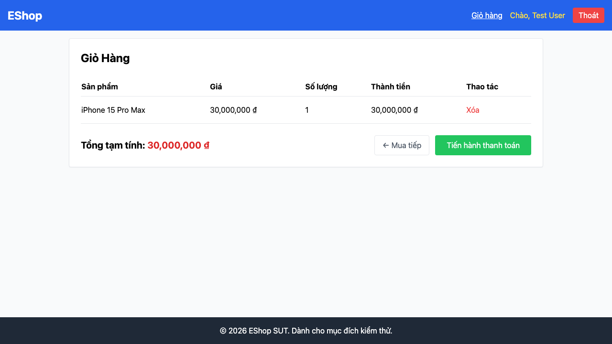

# GUI-IA04-15: Giỏ được reset sau khi thanh toán thành công

## Requirement ID
Heuristic (state consistency)

## Module / Test type / Technique
Phản hồi & Trạng thái (Feedback & State) / GUI/Usability / Checklist-based GUI Testing

## Checklist coverage
| Thuộc tính | Giá trị |
| :--- | :--- |
| Checklist ID | GUI-IA04-15 |
| Interface Aspect | Phản hồi & Trạng thái (Feedback & State) |
| Actor | Người dùng cuối (khách) |
| Goal | Giỏ được reset sau khi thanh toán thành công. |
| Screen(s) | Thanh toán, Giỏ hàng |
| Checklist item | Sau thanh toán thành công giỏ được reset (hiện clearCart không bao giờ gọi — Checkout.jsx:9, 62). |
| Traced to | Heuristic (state consistency) |

## Preconditions
- SUT đang chạy (`run_servers.sh`); Frontend Web khách hàng tại `localhost:5173`, backend tại `localhost:3000`.
- Đã đăng nhập bằng tài khoản `test@eshop.com` / `Test1234!`.
- Giỏ hàng có sẵn ít nhất 1 sản phẩm.

## Test data
| Tham số | Giá trị thử nghiệm |
| :--- | :--- |
| Actor | Người dùng cuối (khách) |
| Interface | Frontend Web (khách) — UI |
| Endpoint / UI flow | /checkout , /cart |
| Input / Payload | Hoàn tất 1 đơn hàng |
| Fixture | Giỏ có hàng; tài khoản test@eshop.com |

## Test steps
1. Thêm SP, đăng nhập, hoàn tất thanh toán ở `/checkout`.
2. Mở lại `/cart`.
3. Fail nếu giỏ vẫn còn sản phẩm cũ.

## Expected result
- Đặt hàng thành công → giỏ hàng trở về trống.
- Quay lại `/cart` không còn sản phẩm cũ.

## Status / Related bugs
Failed — xem screenshot & Issue liên quan

## Actual result
- Executed by: Đặng Trường Nguyên
- Execution date: 2026-07-25
- Execution interface: Frontend Web (khách) — Playwright/Chromium
- Execution tool: Playwright (Chromium headless) — tự động hoá
- Observed: Sau thanh toán thành công, giỏ hàng vẫn còn 1 sản phẩm cũ (clearCart không được gọi) — trạng thái giỏ không được reset.
- Execution result: **Failed**
- Screenshot: 
