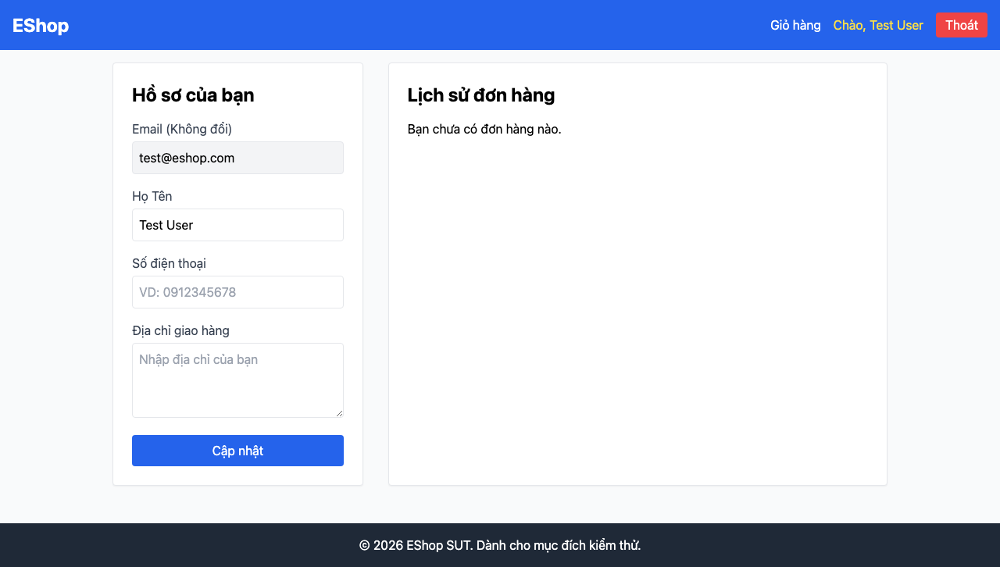

# GUI-IA04-16: Lỗi API tải đơn phân biệt với trạng thái chưa có đơn

## Requirement ID
Heuristic (error vs empty)

## Module / Test type / Technique
Phản hồi & Trạng thái (Feedback & State) / GUI/Usability / Checklist-based GUI Testing

## Checklist coverage
| Thuộc tính | Giá trị |
| :--- | :--- |
| Checklist ID | GUI-IA04-16 |
| Interface Aspect | Phản hồi & Trạng thái (Feedback & State) |
| Actor | Người dùng đã đăng nhập |
| Goal | Lỗi API tải đơn phân biệt với trạng thái chưa có đơn. |
| Screen(s) | Lịch sử ĐH |
| Checklist item | Lỗi API tải đơn hiển thị khác empty state (hiện lỗi bị nuốt → hiện "chưa có đơn" — Profile.jsx:26-29). |
| Traced to | Heuristic (error vs empty) |

## Preconditions
- SUT đang chạy (`run_servers.sh`); Frontend Web khách hàng tại `localhost:5173`, backend tại `localhost:3000`.
- Đã đăng nhập bằng tài khoản `test@eshop.com` / `Test1234!`.

## Test data
| Tham số | Giá trị thử nghiệm |
| :--- | :--- |
| Actor | Người dùng đã đăng nhập |
| Interface | Frontend Web (khách) — tắt backend / block request |
| Endpoint / UI flow | /profile |
| Input / Payload | Block `/api/orders/my-orders` |
| Fixture | Tài khoản có đơn hàng |

## Test steps
1. Đăng nhập tài khoản CÓ đơn hàng.
2. Block/làm lỗi request `/api/orders/my-orders`, mở `/profile`.
3. Fail nếu hiện "chưa có đơn hàng" trong khi thực chất là lỗi API.

## Expected result
- Lỗi API tải đơn → hiển thị message lỗi.
- Chỉ hiện "Bạn chưa có đơn hàng nào" khi thật sự 0 đơn.

## Status / Related bugs
Failed — BUG-19 (https://github.com/trngnneee/eshop-sut/issues/212)

## Actual result
- Executed by: Đặng Trường Nguyên
- Execution date: 2026-07-25
- Execution interface: Frontend Web (khách) — kiểm thử thủ công trên trình duyệt Chrome (block API)
- Observed: Lỗi API tải đơn bị "nuốt" (catch → setOrders([])) nên hiển thị "Bạn chưa có đơn hàng nào" giống hệt trạng thái trống — không phân biệt lỗi với empty.
- Execution result: **Failed**
- Screenshot: 
