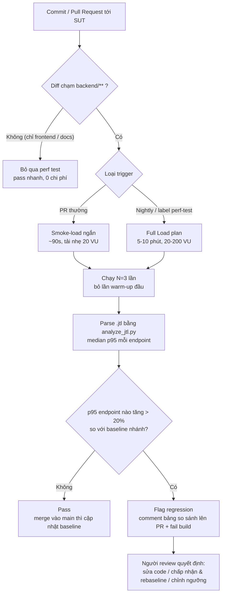

# Task 3 — Continuous Performance Testing (đề xuất, phần kết luận)

- Họ và tên: Đặng Trường Nguyên
- MSSV: 23127438

Bài này chạy perf test **thủ công một lần** trên máy cá nhân. Để biến nó thành thứ **chạy liên tục theo mỗi thay đổi của SUT**, em đề xuất một pipeline CI: *theo dõi commit → quyết định có test không → chạy smoke-load → so p95 với baseline → flag regression*. Mô hình bám đúng ba đặc thù đã đo được ở Task 1–2 (baseline p95 ~7ms, checkout là endpoint nặng nhất, và nguồn nhiễu lớn nhất là máy chạy test), nên nó thực tế chứ không phải khẩu hiệu.

---

## 1. Nguyên tắc thiết kế

1. **Không chạy mù mọi commit.** Perf test tốn thời gian + máy; chỉ chạy khi thay đổi *có khả năng* ảnh hưởng hiệu năng API (đụng `backend/**`). Sửa frontend/docs → bỏ qua.
2. **Ngưỡng tương đối, không tuyệt đối.** Máy CI dao động, nên so **p95 so với baseline của chính nhánh** (regression nếu tăng > 20%), không đặt con số cứng kiểu "p95 < 50ms" (số này phụ thuộc phần cứng runner).
3. **Chạy nhiều lần lấy median.** Một lần đo trên CI rất nhiễu → chạy N=3 lần, lấy **median p95** để dập nhiễu trước khi kết luận.
4. **Fail sớm, rẻ.** PR chạy smoke-load ngắn (~90s); bản đầy đủ (Load 5–10 phút) để nightly hoặc khi gắn label `perf-test`.
5. **Canary theo endpoint.** So p95 **từng endpoint**, ưu tiên `POST /api/checkout` (ghi đĩa, nặng nhất — regression lộ ở đây trước) thay vì chỉ nhìn p95 tổng.

---

## 2. Flow chart pipeline

---

## 3. Cơ chế từng bước

| Bước | Làm gì | Cụ thể cho SUT này |
|---|---|---|
| __Watch__ | GitHub Actions trigger `on: pull_request` + `on: schedule` (nightly) | Path filter `backend/**` — vì frontend không đổi hiệu năng API. Cho phép override bằng label `perf-test`. |
| __Decide__ | Nếu diff không chạm `backend/**` và không có label → skip, trả pass xanh ngay | Tránh đốt runner cho commit sửa README/CSS. |
| __Run__ | Dựng backend (`node server.js` + seed), chạy JMeter non-GUI plan đã có | Dùng lại `23127438_Load_20260815.jmx` (bản rút gọn 90s cho PR); `monitor.sh` log CPU/RAM node. |
| __Measure__ | Parse `.jtl` lấy p95 mỗi endpoint, chạy N=3 lấy __median__ | Dùng lại `analyze_jtl.py` — đã tính percentile ground-truth ở Task 2, khỏi tin dashboard. |
| __Compare__ | So median p95 với baseline lưu trong repo (`perf_baseline.json`) | Baseline hiện tại: checkout p95 ≈ 8ms, login ≈ 5ms, read ≈ 4ms (từ Load). |
| __Act__ | Regression > 20% ở endpoint bất kỳ → comment bảng lên PR + `exit 1`; ngược lại pass | Khi merge vào `main` và pass → tự cập nhật baseline (rebaseline có kiểm soát). |

__Ví dụ điều kiện flag:__ `median_p95(checkout) = 11ms` vs baseline `8ms` → +37.5% > 20% → __fail__, comment: _"⚠ checkout p95 8ms → 11ms (+37.5%) — nghi regression do commit này."_

---

## 4. Chống false alarm

Máy CI **không ổn định** (shared runner, CPU throttling, hàng xóm ồn) → đây là nguồn báo động giả số một. Biện pháp:

- **N lần + median**, bỏ lần đầu (JIT/cache warm-up) → loại spike ngẫu nhiên như max 51ms ở Task 2 vốn chỉ là 1/63,398 sample.
- **Ngưỡng tương đối 20%**, không tuyệt đối → tự thích nghi khi đổi runner.
- **Pin runner cố định** (cùng loại máy) + tag; không so kết quả giữa hai loại runner khác nhau.
- **So theo endpoint** → một endpoint nhiễu không kéo p95 tổng gây fail oan; đồng thời regression thật ở checkout không bị read nhanh "pha loãng".
- **Cảnh báo 2 mức:** tăng 10–20% = warning (comment, vẫn pass); > 20% = fail. Tránh chặn merge vì nhiễu nhỏ.
- **Yêu cầu tải đủ lớn** để p95 có ý nghĩa thống kê (smoke 90s vẫn cho vài nghìn sample như Load).

---

## 5. Trade-offs

| Chiều | Lợi | Chi phí / Rủi ro | Cách cân bằng |
|---|---|---|---|
| **Chi phí máy** | Bắt regression sớm, rẻ hơn sự cố production | Mỗi PR đụng backend tốn 1 runner vài phút × N lần | Path filter + smoke ngắn cho PR, full run chỉ nightly |
| **Thời gian pipeline** | Feedback ngay trên PR | N×90s + dựng SUT làm chậm merge | Chạy song song với unit test; full/nightly tách khỏi luồng PR |
| **False alarm** | — | Nhiễu runner → fail oan → dev mất niềm tin, bắt đầu bỏ qua | median N lần + ngưỡng tương đối + 2 mức cảnh báo (mục 4) |
| **False negative** | — | Regression nhỏ < 20% lọt qua; smoke 90s có thể không lộ leak dài | Nightly full Load + soak định kỳ bắt cái PR bỏ sót |
| **Bảo trì baseline** | Baseline luôn phản ánh hiện trạng | Rebaseline sai (chấp nhận regression nhầm) làm trôi ngưỡng | Chỉ rebaseline khi merge vào `main` + review chủ động |

**Khi nào nên bỏ qua test:** commit chỉ sửa frontend/docs/test; hotfix khẩn (chạy async, không chặn merge); hoặc khi runner đang quá tải (hoãn sang nightly). Ghi rõ lý do skip để không thành thói quen tắt kiểm tra.

---

## 6. Kết luận

Mô hình này __tái dùng nguyên artifact của Task 1–2__ (JMeter plan, `monitor.sh`, `analyze_jtl.py`) và đóng vòng lặp: mỗi thay đổi backend được đo lại tự động, p95 so với baseline, regression bị chặn ngay trên PR trước khi vào production. Chìa khóa để nó _dùng được thật_ không nằm ở việc chạy JMeter trong CI — mà ở __kỷ luật chống nhiễu__ (median nhiều lần, ngưỡng tương đối, cảnh báo 2 mức); thiếu phần đó, pipeline sẽ báo động giả liên tục và bị cả team tắt đi — đúng cái bẫy mà chính giới hạn "test trên 1 máy" ở Task 1 đã cho thấy.
