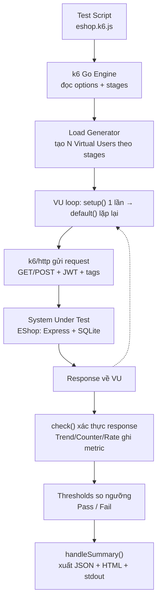
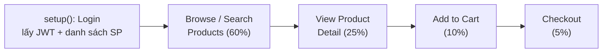
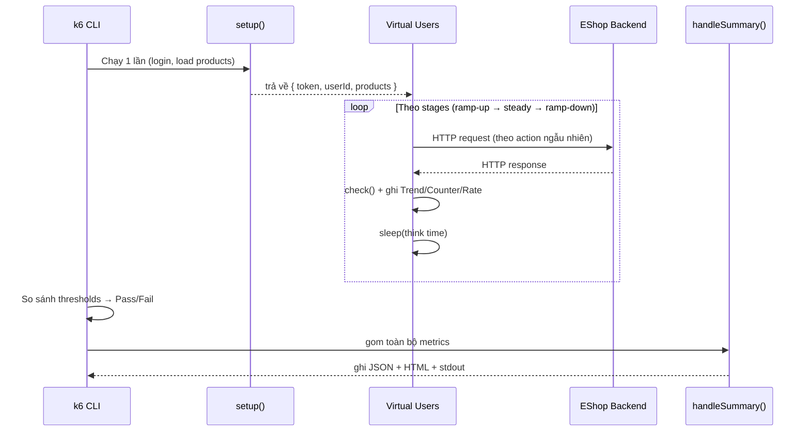
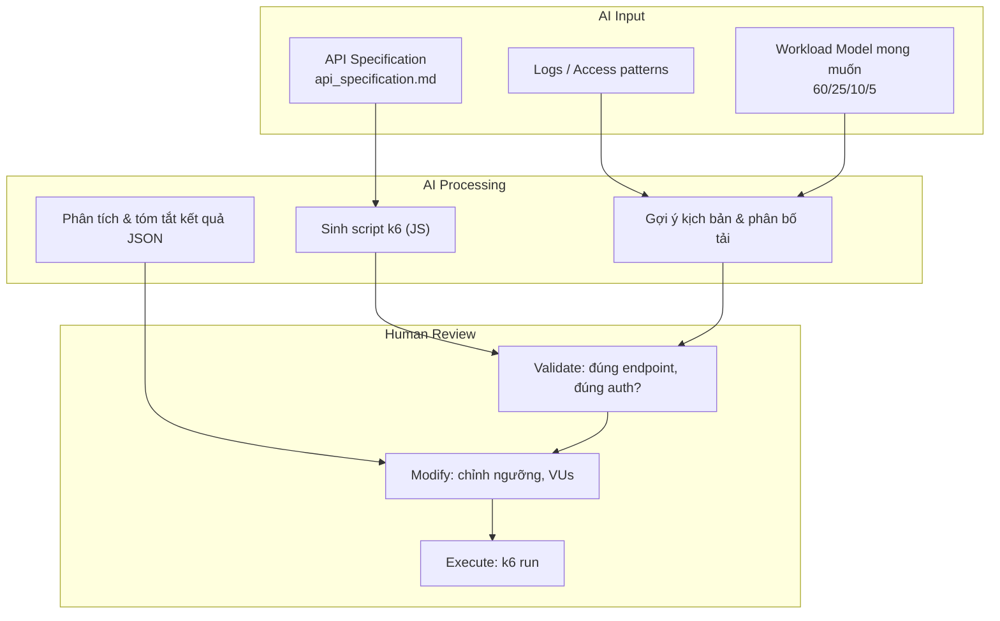

# k6 – Performance Testing Tool Documentation

---

## Mục lục

1. [Tool Overview – Giới thiệu công cụ](#1-tool-overview--giới-thiệu-công-cụ)
2. [Purpose & Use Cases – Mục đích và phạm vi sử dụng](#2-purpose--use-cases--mục-đích-và-phạm-vi-sử-dụng)
3. [Tool Architecture – Kiến trúc hoạt động](#3-tool-architecture--kiến-trúc-hoạt-động)
4. [Main Features – Các chức năng chính](#4-main-features--các-chức-năng-chính)
5. [Usability Evaluation – Khả năng sử dụng](#5-usability-evaluation--khả-năng-sử-dụng)
6. [Installation – Hướng dẫn cài đặt](#6-installation--hướng-dẫn-cài-đặt)
7. [Usage Guide – Hướng dẫn sử dụng cơ bản](#7-usage-guide--hướng-dẫn-sử-dụng-cơ-bản)
8. [Workload Model & Test Scenario – Thiết kế kịch bản tải](#8-workload-model--test-scenario--thiết-kế-kịch-bản-tải)
9. [Execution Process – Quy trình thực thi](#9-execution-process--quy-trình-thực-thi)
10. [Reporting & Metrics Analysis – Báo cáo và phân tích kết quả](#10-reporting--metrics-analysis--báo-cáo-và-phân-tích-kết-quả)
11. [Strengths & Limitations – Ưu điểm và hạn chế](#11-strengths--limitations--ưu-điểm-và-hạn-chế)
12. [AI-Augmented Integration – Ứng dụng AI](#12-ai-augmented-integration--ứng-dụng-ai)
13. [Demo Scenario – Kịch bản trình diễn](#13-demo-scenario--kịch-bản-trình-diễn)
14. [Conclusion – Đánh giá và kết luận](#14-conclusion--đánh-giá-và-kết-luận)

---

## 1. Tool Overview – Giới thiệu công cụ

| Tiêu chí | Nội dung |
| --- | --- |
| **Tool là gì?** | k6 là một công cụ **load testing / performance testing** mã nguồn mở, hiện đại, chạy trên dòng lệnh (CLI). Tester viết kịch bản kiểm thử bằng **JavaScript (ES6)** và k6 sẽ mô phỏng nhiều người dùng ảo (Virtual Users) gửi request đến hệ thống để đo hiệu năng. |
| **Ai phát triển?** | Được phát triển bởi **Grafana Labs** (ban đầu là công ty Load Impact, mã nguồn cốt lõi viết bằng **Go**). |
| **Mục đích sử dụng?** | Đo lường và đánh giá **hiệu năng, độ ổn định, khả năng chịu tải** của web app, REST API, microservices... dưới các mức tải khác nhau (bình thường, cao điểm, đột biến). |
| **Loại công cụ** | • **Open-source** (giấy phép AGPL-3.0), có bản Grafana Cloud k6 thương mại.<br>• **Script-based** (không phải GUI): kịch bản là code JavaScript.<br>• **Local-first**: chạy trên máy local/CI runner; tùy chọn chạy phân tán qua Grafana Cloud/k6 Operator (Kubernetes). |

**Vì sao chọn k6 cho demo EShop?**

- Kịch bản là code JS → dễ đưa vào Git, dễ review, dễ version control (khác với file XML nhị phân của JMeter).
- Engine viết bằng Go → một máy local có thể tạo ra hàng trăm VUs với chi phí CPU/RAM thấp.
- Tích hợp sẵn `thresholds` (ngưỡng pass/fail) → biến performance test thành một bước **kiểm thử tự động có Pass/Fail rõ ràng**, phù hợp CI/CD.

---

## 2. Purpose & Use Cases – Mục đích và phạm vi sử dụng

### 2.1 Hệ thống có thể kiểm thử

| Đối tượng | k6 hỗ trợ | Ghi chú |
| --- | :---: | --- |
| Web application (HTTP/HTTPS) | ✅ | Qua module `k6/http` |
| REST API | ✅ | Trường hợp dùng chính trong demo EShop |
| GraphQL | ✅ | Gửi POST query như HTTP thường |
| WebSocket | ✅ | Module `k6/ws` |
| gRPC | ✅ | Module `k6/net/grpc` |
| Microservices | ✅ | Test từng service hoặc cả luồng liên service |
| Message queue / Kafka / Redis | ✅ | Qua các extension **xk6** |
| Database | ⚠️ Gián tiếp | Không phải thế mạnh; thường test qua API rồi suy ra tải DB (như EShop test qua API → SQLite) |
| Browser (UI thật, render DOM) | ⚠️ Hạn chế | Có module `k6/browser` (Chromium) nhưng tốn tài nguyên, không phải thế mạnh chính |

### 2.2 Các loại performance testing k6 hỗ trợ

| Loại test | Mục đích | Cách cấu hình trong k6 | Áp dụng cho EShop |
| --- | --- | --- | --- |
| **Load Testing** | Đo hiệu năng ở mức tải bình thường/kỳ vọng | `stages` giữ VUs ổn định | ✅ Profile `baseline` (50 VUs) |
| **Stress Testing** | Tăng tải dần vượt ngưỡng để tìm điểm gãy | `stages` tăng VUs bậc thang | Có thể mở rộng từ baseline |
| **Spike Testing** | Tải tăng đột biến trong thời gian rất ngắn | `stages` nhảy vọt VUs (50→500) | ✅ Profile `spike` |
| **Endurance/Soak Testing** | Giữ tải trong thời gian dài để phát hiện rò rỉ bộ nhớ | `stages` giữ VUs nhiều giờ | Có thể mở rộng |
| **Scalability Testing** | Đánh giá khả năng mở rộng khi tăng dần tài nguyên/tải | So sánh nhiều lần chạy ở các mức VUs | Có thể mở rộng |
| **Smoke Testing** | Chạy nhanh với tải rất nhỏ để kiểm tra script còn hoạt động | 1 VU, thời gian ngắn | ✅ Profile `smoke` |

> Trong project này, script `eshop.k6.js` đã đóng gói sẵn 3 profile: __smoke → baseline → spike__ thông qua biến môi trường `K6_PROFILE`.

---

## 3. Tool Architecture – Kiến trúc hoạt động

### 3.1 Mô hình tổng quát

```text
        Test Script (eshop.k6.js - JavaScript)
                        |
                        ↓
        k6 Engine (viết bằng Go) đọc `options`, `stages`
                        |
                        ↓
        Virtual Users (VUs) — mỗi VU chạy vòng lặp default()
                        |
                        ↓
        HTTP Requests (k6/http) → có gắn tags, headers, JWT
                        |
                        ↓
        System Under Test (EShop backend @ localhost:3000)
                        |
                        ↓
        Metrics Engine thu thập số liệu mỗi request
                        |
                        ↓
        handleSummary() → xuất JSON / HTML / stdout
```

### 3.2 Kiến trúc chi tiết (sơ đồ)



### 3.3 Các thành phần chính

| Thành phần | Vai trò | Trong script EShop |
| --- | --- | --- |
| __Thành phần tạo tải (Load Generator)__ | Sinh ra và điều phối số lượng VUs theo thời gian | `options.stages` → hàm `buildStages()` |
| __Virtual User (VU)__ | Một "người dùng ảo" chạy song song, lặp lại logic trong `default()` | `export default function(data)` |
| __Thành phần gửi request__ | Client HTTP thực hiện GET/POST | Module `k6/http` — `http.get(...)`, `http.post(...)` |
| __Thành phần khởi tạo dùng chung__ | Chạy __1 lần__ trước khi bắt đầu tải, lấy dữ liệu dùng chung (login lấy token, load danh sách sản phẩm) | `export function setup()` |
| __Thành phần thu thập kết quả (Metrics)__ | Ghi lại số liệu mỗi request | Metric có sẵn (`http_req_duration`, `http_req_failed`...) + metric tự định nghĩa (`Trend`, `Counter`, `Rate`) |
| __Thành phần xác thực__ | Kiểm tra response đúng/sai (không chỉ đo tốc độ) | `check()` + `recordCheck()` |
| __Thành phần lưu kết quả__ | Quyết định xuất báo cáo ra đâu | `handleSummary()` → ghi vào thư mục `reports/` |

### 3.4 Cách lưu kết quả

Sau khi test xong, `handleSummary()` trong script này ghi ra:

```text
reports/k6-<profile>-summary.json   ← dữ liệu thô đầy đủ (theo profile)
reports/k6-<profile>-summary.html   ← báo cáo HTML dễ đọc (theo profile)
reports/k6-summary.json             ← bản mới nhất (ghi đè)
reports/k6-summary.html             ← bản mới nhất (ghi đè)
stdout                              ← tóm tắt in ra terminal
```

---

## 4. Main Features – Các chức năng chính

| Feature (chức năng) | Purpose (mục đích) | Cơ chế trong k6 | Usage in EShop Demo |
| --- | --- | --- | --- |
| __Test Scenario / Executor__ | Định nghĩa hành vi người dùng | Hàm `default()` + `group()` | Mô phỏng luồng mua sắm: browse → detail → cart → checkout |
| __Load Generator (VUs & Stages)__ | Tạo người dùng ảo, điều khiển tăng/giảm tải | `options.stages` (ramp-up/steady/ramp-down) | 50 VUs (baseline), tăng vọt 500 VUs (spike) |
| __Request / HTTP module__ | Gửi request đến SUT | `k6/http` (`http.get`, `http.post`) | Gọi `/api/products`, `/api/cart`, `/api/checkout` |
| __Data Parameterization__ | Quản lý dữ liệu test (biến động, tài khoản, sản phẩm) | Biến `__ENV`, `setup()` trả về data dùng chung | Login lấy JWT một lần, random sản phẩm & từ khóa tìm kiếm |
| __Timer / Think Time__ | Mô phỏng thời gian "suy nghĩ" của người dùng thật | `sleep()` | `sleep(K6_THINK_TIME || 1)` giữa mỗi hành động |
| __Assertion / Validation__ | Kiểm tra tính đúng đắn của response | `check()` | Xác thực status 200, đúng cấu trúc JSON, có `orderId`... |
| __Thresholds (Pass/Fail)__ | Định nghĩa tiêu chí đạt/không đạt của cả bài test | `options.thresholds` | `p(95)<1000ms`, error rate `<5%`, check pass `>95%` |
| __Custom Metrics__ | Đo các chỉ số nghiệp vụ riêng | `Trend`, `Counter`, `Rate` | Đếm số hành động từng loại, đo latency riêng từng bước |
| __Reporting__ | Xuất báo cáo phân tích | `handleSummary()` | Xuất JSON + HTML + tóm tắt terminal |
| __Tagging__ | Gắn nhãn để phân tách metric theo endpoint | `tags: { endpoint: ... }` | Tách số liệu theo từng API |

**Trích dẫn code minh họa (custom metrics & thresholds trong `eshop.k6.js`):**

```javascript
// Custom metrics
const browseDuration   = new Trend("browse_search_response_time", true);
const checkoutActions  = new Counter("checkout_actions");
const businessSuccessRate = new Rate("business_success_rate");

// Thresholds — tiêu chí Pass/Fail của cả bài test
export const options = {
  thresholds: {
    http_req_failed:       ["rate<0.05"],   // < 5% request lỗi
    http_req_duration:     ["p(95)<1000"],  // 95% request < 1000ms
    checks:                ["rate>0.95"],   // > 95% check pass
    business_success_rate: ["rate>0.95"],   // > 95% nghiệp vụ thành công
  },
};
```

---

## 5. Usability Evaluation – Khả năng sử dụng

### 5.1 User Interface

| Câu hỏi | Trả lời |
| --- | --- |
| Có GUI không? | **Không** (bản open-source). k6 là công cụ CLI. Việc trực quan hóa cần tích hợp thêm Grafana + InfluxDB/Prometheus, hoặc dùng báo cáo HTML như trong project. |
| Có dễ tạo test không? | Trung bình — cần biết viết JavaScript, nhưng cú pháp gần gũi với lập trình viên web. |
| Có cần code không? | **Có.** Toàn bộ kịch bản là code JS (điểm khác biệt lớn so với JMeter kéo-thả). |

### 5.2 Learning Curve (độ khó học)

- **Beginner:** Dễ bắt đầu nếu đã biết JavaScript cơ bản — một script tối thiểu chỉ cần `http.get()` + `check()`. Ngược lại, người quen GUI (JMeter) sẽ thấy lạ vì phải viết code.
- **Advanced:** Các tính năng nâng cao (custom executors, scenarios song song nhiều luồng, xk6 extensions, chạy phân tán trên Kubernetes) có độ khó cao hơn nhưng tài liệu chính thức đầy đủ.

### 5.3 Script Management (quản lý kịch bản)

| Tiêu chí | k6 |
| --- | --- |
| Script lưu dạng gì? | File __JavaScript__ (`.js`) — văn bản thuần |
| Dễ chỉnh sửa? | ✅ Rất dễ — chỉnh trong editor bất kỳ (VS Code...) |
| Dễ chia sẻ? | ✅ Chỉ là 1 file text, gửi qua Git/email đều được |
| Version control? | ✅✅ Rất tốt — diff rõ ràng trên Git (ưu thế lớn so với XML nhị phân của JMeter) |
| Tái sử dụng? | ✅ Trong EShop, cùng 1 file `eshop.k6.js` phục vụ cả 3 profile nhờ biến `__ENV` |

> **Nhận xét:** k6 hy sinh sự trực quan của GUI để đổi lấy khả năng **quản lý kịch bản như code (Testing as Code)** — rất phù hợp với quy trình DevOps/CI-CD hiện đại.

---

## 6. Installation – Hướng dẫn cài đặt

### 6.1 System Requirements & Dependencies

- Hệ điều hành: macOS / Linux / Windows.
- **Không cần Java** (khác JMeter) và **không cần Node.js để chạy k6** — vì k6 là binary Go độc lập.
   - *Lưu ý:* dù script viết bằng JavaScript, k6 **không dùng Node.js runtime**; nó có JS engine riêng (goja). Node.js trong project này chỉ dùng cho `npm run ...` scripts tiện lợi và để chạy backend EShop.

- Đủ CPU/RAM cho số VUs mong muốn (vài trăm VUs chạy tốt trên laptop thông thường).

### 6.2 Installation Steps

**macOS (Homebrew) — khuyến nghị cho môi trường của project:**

```bash
brew install k6
```

**Windows (Chocolatey):**

```powershell
choco install k6
```

**Linux (Debian/Ubuntu):**

```bash
sudo gpg -k
sudo gpg --no-default-keyring --keyring /usr/share/keyrings/k6-archive-keyring.gpg \
  --keyserver hkp://keyserver.ubuntu.com:80 --recv-keys C5AD17C747E3415A3642D57D77C6C491D6AC1D69
echo "deb [signed-by=/usr/share/keyrings/k6-archive-keyring.gpg] https://dl.k6.io/deb stable main" \
  | sudo tee /etc/apt/sources.list.d/k6.list
sudo apt-get update && sudo apt-get install k6
```

**Docker (không cài trực tiếp):**

```bash
docker run --rm -i grafana/k6 run - < scripts/eshop.k6.js
```

### 6.3 Configuration & Verify

Kiểm tra cài đặt thành công:

```bash
k6 version
```

> Trong project này, `k6` đã được cài __global__ sẵn trên máy (xem `README.md` mục _Install Tools_). Không cần cấu hình biến môi trường bắt buộc; các tham số test được truyền qua `__ENV` khi chạy.

---

## 7. Usage Guide – Hướng dẫn sử dụng cơ bản

Quy trình 6 bước, gắn với chính script EShop:

### Bước 1 — Tạo test script

Kịch bản đã có sẵn: `tests/performance_testing/scripts/eshop.k6.js`. Một script k6 cơ bản gồm 3 phần: `options` (cấu hình), `setup()` (chạy 1 lần), `default()` (mỗi VU lặp lại).

### Bước 2 — Cấu hình workload (số user, thời gian, ramp-up)

Cấu hình qua `options.stages`. Trong project được đóng gói thành profile chọn bằng `K6_PROFILE`:

```javascript
// baseline: 50 VUs, ramp-up 1m, steady 3m, ramp-down 1m
{ duration: "1m", target: 50 },
{ duration: "3m", target: 50 },
{ duration: "1m", target: 0  },
```

### Bước 3 — Định nghĩa kịch bản người dùng (actions/requests)

Trong `default()`, mỗi VU chọn ngẫu nhiên 1 hành động theo trọng số rồi gửi request tương ứng (browse / detail / cart / checkout).

### Bước 4 — Chạy test

Từ thư mục `tests/performance_testing` (nhớ khởi động backend trước):

```bash
# 0. Khởi động backend (ở terminal khác, tại repo root)
cd backend && npm start

# 1. Smoke test — kiểm tra nhanh script còn chạy
npm run k6:smoke

# 2. Baseline (load) test — tải bình thường 50 VUs
npm run k6:baseline

# 3. Spike test — tải đột biến 500 VUs
npm run k6:spike
```

Có thể override tham số qua biến môi trường:

```bash
BASE_URL=http://localhost:3000 K6_VUS=20 K6_STEADY=1m npm run k6:smoke
```

### Bước 5 — Thu thập kết quả

k6 tự động ghi ra `reports/` (JSON + HTML) và in tóm tắt ra terminal nhờ `handleSummary()`.

### Bước 6 — Phân tích số liệu

Đọc file HTML (`reports/k6-baseline-summary.html`) hoặc ghi kết quả vào `report/performance-report.md`. Xem chi tiết ở [mục 10](#10-reporting--metrics-analysis--báo-cáo-và-phân-tích-kết-quả).

---

## 8. Workload Model & Test Scenario – Thiết kế kịch bản tải

### 8.1 User Behavior (hành vi người dùng)

Kịch bản mô phỏng phễu mua sắm (e-commerce funnel) điển hình của EShop:



> Đây là **phân bố xác suất theo hành động** (weighted probability), không phải một chuỗi tuần tự bắt buộc: mỗi lần lặp (iteration), một VU "tung xúc xắc" và thực hiện **một** hành động theo trọng số. Cách này phản ánh đúng thực tế: rất nhiều người chỉ xem/tìm kiếm, rất ít người thực sự thanh toán.

### 8.2 Weighted Distribution — code thực tế

```javascript
function pickWeightedAction() {
  const value = Math.random();
  if (value < 0.60) return "browse";   // 60% — xem/tìm sản phẩm
  if (value < 0.85) return "detail";   // 25% — xem chi tiết
  if (value < 0.95) return "cart";     // 10% — thêm giỏ hàng
  return "checkout";                    //  5% — thanh toán
}
```

### 8.3 Workload Configuration (bảng cấu hình 3 profile)

| Parameter | Smoke | Baseline (Load) | Spike |
| --- | --- | --- | --- |
| Target VUs | 1 | 50 | 50 → **500** |
| Ramp-up | 5s | 1 min | 30s (nhảy vọt lên 500) |
| Steady state | 10s | 3 min | 1 min |
| Ramp-down | 5s | 1 min | 30s |
| Distribution | Browse 60% · Detail 25% · Cart 10% · Checkout 5% (giống nhau cho cả 3) |||
| Think time | `sleep` 1s giữa các hành động ||||
| Mục đích | Kiểm tra script | Đo hiệu năng tải bình thường | Kiểm tra chịu tải đột biến |

### 8.4 Endpoint mapping (kịch bản → API EShop)

| User action | HTTP request | Yêu cầu JWT? | check() xác thực |
| --- | --- | :---: | --- |
| Browse/Search | `GET /api/products` hoặc `?search=...` | Không | status 200 + trả về mảng |
| View Detail | `GET /api/products/:id` | Không | status 200 + đúng `id` |
| Add to Cart | `POST /api/cart` | ✅ Bearer | status 200 + message "Added to cart" |
| Checkout | `POST /api/checkout` | ✅ Bearer | status 200 + có `orderId` |

---

## 9. Execution Process – Quy trình thực thi

### 9.1 Vòng đời một lần chạy k6



### 9.2 Các giai đoạn (lifecycle stages) của k6

| Giai đoạn | Hàm | Số lần chạy | Vai trò trong EShop |
| --- | --- | --- | --- |
| __Init__ | (phần ngoài hàm) | 1 lần/VU | Import module, khai báo metrics, đọc `__ENV` |
| __Setup__ | `setup()` | 1 lần toàn cục | Login lấy JWT + tải danh sách sản phẩm dùng chung |
| __VU code__ | `default(data)` | Lặp liên tục | Mỗi VU thực hiện 1 action, `check`, `sleep` |
| __Teardown__ | `teardown()` | 1 lần toàn cục | (Không dùng trong script này) |
| __Summary__ | `handleSummary()` | 1 lần cuối | Xuất báo cáo JSON/HTML/stdout |

### 9.3 Cơ chế Pass/Fail

Khi kết thúc, k6 đối chiếu số liệu với `thresholds`. Nếu bất kỳ ngưỡng nào bị vi phạm, **k6 trả về exit code khác 0** → CI/CD sẽ đánh dấu bước test là **thất bại**. Đây là điểm khiến k6 phù hợp làm cổng kiểm soát chất lượng (quality gate) tự động.

---

## 10. Reporting & Metrics Analysis – Báo cáo và phân tích kết quả

### 10.1 Các dạng báo cáo k6 cung cấp

| Dạng | Nguồn | Trong project |
| --- | --- | --- |
| **Terminal summary** | Mặc định / `handleSummary` | Bảng tóm tắt in ra stdout khi chạy xong |
| **JSON thô** | `handleSummary` | `reports/k6-<profile>-summary.json` |
| **HTML report** | `handleSummary` | `reports/k6-<profile>-summary.html` |
| **Dashboard thời gian thực** | Grafana + InfluxDB/Prometheus (tùy chọn) | Chưa dùng — có thể mở rộng |
| **Grafana Cloud k6** | Bản thương mại (tùy chọn) | Chưa dùng |

### 10.2 Các metric quan trọng

| Metric | Ý nghĩa | Tên trong k6 |
| --- | --- | --- |
| __Response Time__ | Thời gian xử lý request (avg/med/max) | `http_req_duration` |
| __Percentile (p95/p99)__ | Trải nghiệm của 95%/99% người dùng — quan trọng hơn trung bình | `http_req_duration: p(95)`, `p(99)` |
| __Throughput__ | Số request xử lý mỗi giây | `http_reqs` (rate) |
| __Error Rate__ | Tỷ lệ request thất bại | `http_req_failed` |
| __Check pass rate__ | Tỷ lệ assertion đúng | `checks` |
| __Iterations__ | Số vòng lặp hoàn thành | `iterations` |
| __VUs__ | Số người dùng ảo đồng thời | `vus`, `vus_max` |
| __Custom (nghiệp vụ)__ | Đếm/đo riêng từng hành động | `browse_search_actions`, `checkout_actions`, `business_success_rate`... |
| __Resource Usage (CPU/RAM)__ | Tài nguyên phía server | ⚠️ k6 __không__ đo — cần công cụ hệ thống riêng (chưa giám sát trong lần chạy này) |

### 10.3 Kết quả đo thực tế trên EShop

> Nguồn: `report/performance-report.md` (ngày chạy 2026-07-11). Backend chạy local `Node.js + Express + SQLite`.

**Baseline (50 VUs, ~5 phút):**

| Metric | Value |
| --- | --- |
| Total requests | 12,036 |
| Completed iterations | 12,034 |
| Throughput | 40.04 req/s |
| Avg response time | 1.09 ms |
| Median | 0.78 ms |
| **p95 latency** | **3.80 ms** |
| p99 latency | 4.65 ms |
| Error rate | 0.00% |
| Check pass rate | 100.00% |

**Spike (50 → 500 VUs):**

| Metric | Value |
| --- | --- |
| Total requests | 45,943 |
| Completed iterations | 45,941 |
| Throughput | 378.43 req/s |
| Avg response time | 1.15 ms |
| **p95 latency** | **3.73 ms** |
| p99 latency | 5.95 ms |
| Error rate | 0.00% |
| Check pass rate | 100.00% |

**Phân bố hành động quan sát được (spike)** — khớp gần như hoàn hảo với mô hình thiết kế:

| Action | Target | Observed |
| --- | ---: | ---: |
| Browse/Search | 60% | 59.99% |
| View Detail | 25% | 25.26% |
| Add to Cart | 10% | 9.68% |
| Checkout | 5% | 5.07% |

**Phân tích:** Ở cả hai profile, EShop giữ **0.00% error rate** và **100% check pass**. Ngay cả khi tải nhảy vọt lên 500 VUs (throughput ~378 req/s), p95 vẫn ~3.73 ms — không thấy backend crash, không thấy khóa SQLite, không mất request. Phân bố hành động thực tế bám sát trọng số thiết kế → chứng minh workload model hoạt động đúng. (Lưu ý: latency ms rất thấp vì SUT chạy local; con số tuyệt đối sẽ khác trên môi trường mạng thật.)

---

## 11. Strengths & Limitations – Ưu điểm và hạn chế

### Strengths (Ưu điểm)

- **Mã nguồn mở, miễn phí**, cộng đồng lớn, tài liệu tốt.
- **Hiệu năng cao (Go engine):** tạo hàng trăm VUs với chi phí CPU/RAM thấp — một máy local đã chạy 500 VUs thoải mái.
- **Testing as Code:** script JavaScript dễ đọc, dễ **version control**, dễ review trên Git (diff rõ ràng).
- **Thresholds Pass/Fail có sẵn:** biến performance test thành quality gate tự động, tích hợp CI/CD dễ dàng (exit code).
- **Custom metrics linh hoạt:** đo được cả chỉ số nghiệp vụ riêng (từng loại hành động).
- **Báo cáo linh hoạt:** `handleSummary()` cho phép tùy biến xuất JSON/HTML/stdout.
- **Đa giao thức:** HTTP, WebSocket, gRPC, GraphQL, và mở rộng qua xk6.

### Limitations (Hạn chế)

- **Không có GUI** (bản open-source) → người quen kéo-thả (JMeter) cần thời gian làm quen; bắt buộc biết JavaScript.
- **Không mô phỏng trình duyệt thật đầy đủ:** tập trung ở tầng protocol (HTTP). Module `k6/browser` có nhưng tốn tài nguyên, không phải thế mạnh → không đo được thời gian render UI/JS phía client.
- **Không đo tài nguyên server (CPU/RAM/DB)** một cách tự nhiên: cần kết hợp công cụ giám sát riêng (Grafana, Prometheus, `top`...). Trong lần chạy EShop này, CPU/RAM chưa được giám sát.
- **Trực quan hóa thời gian thực cần hạ tầng thêm** (InfluxDB/Prometheus + Grafana) hoặc dùng Grafana Cloud (thương mại).
- **Chạy phân tán (distributed)** ở quy mô rất lớn cần Grafana Cloud hoặc k6 Operator trên Kubernetes — phức tạp hơn chạy đơn máy.
- **Không hỗ trợ JavaScript đầy đủ như Node.js:** dùng engine goja, một số thư viện npm/Node API không chạy được.

---

## 12. AI-Augmented Integration – Ứng dụng AI

k6 không có AI tích hợp sẵn trong core, nhưng quy trình dùng k6 có thể được tăng cường bằng AI (ví dụ với chính công cụ như Claude/GPT) theo mô hình sau:



**Ứng dụng thực tế trong project này:**

| AI Input | AI Processing | Human Review |
| --- | --- | --- |
| `api_specification.md` (endpoint, body, auth) | Sinh khung script `eshop.k6.js`, mapping đúng `/api/products`, `/api/cart`, `/api/checkout` | Tester kiểm tra đúng JWT header, đúng cấu trúc JSON |
| Mô tả funnel mua sắm | Đề xuất phân bố trọng số 60/25/10/5 và cấu hình stages | Điều chỉnh số VUs, thời gian theo mục tiêu demo |
| File `k6-summary.json` sau khi chạy | Tóm tắt, phát hiện bất thường, viết mục "Analysis" | Xác nhận số liệu, chốt kết luận trong `performance-report.md` |

> **Nguyên tắc:** AI **hỗ trợ sinh và phân tích**, con người **luôn review, chỉnh sửa và chịu trách nhiệm thực thi** — tránh chạy script/AI output chưa kiểm chứng lên hệ thống.

---

## 13. Demo Scenario – Kịch bản trình diễn

### 13.1 Objective (Mục tiêu demo)

Chứng minh k6 có thể mô phỏng hành vi mua sắm thực tế trên EShop và đo được hiệu năng (response time, throughput, error rate) ở **hai tình huống: tải bình thường (baseline) và tải đột biến (spike)**, kèm tiêu chí Pass/Fail rõ ràng.

### 13.2 Steps (Các bước trình diễn)

```bash
# Bước 1 — Mở & giới thiệu công cụ
k6 version

# Bước 2 — Khởi động SUT (terminal riêng, tại repo root)
cd backend && npm start          # backend @ http://localhost:3000

# Bước 3 — Smoke test: xác nhận script chạy được (nhanh ~20s)
cd tests/performance_testing
npm run k6:smoke

# Bước 4 — Baseline test: tải bình thường 50 VUs (~5 phút)
npm run k6:baseline

# Bước 5 — Spike test: tải đột biến lên 500 VUs
npm run k6:spike
```

```text
# Bước 6 — Mở báo cáo & phân tích
reports/k6-baseline-summary.html   ← mở bằng trình duyệt
reports/k6-spike-summary.html
report/performance-report.md       ← ghi nhận & kết luận
```

### 13.3 Điểm nhấn khi demo

1. Chỉ ra bảng **Workload Action Distribution** trong HTML → observed mix bám sát 60/25/10/5.
2. So sánh **p95 baseline (3.80 ms)** với **p95 spike (3.73 ms)** → hệ thống ổn định dưới tải đột biến.
3. Nhấn mạnh **error rate 0.00%** và **check pass 100%** ở cả hai profile.
4. Giải thích cùng __một script__ phục vụ cả 3 profile chỉ nhờ đổi `K6_PROFILE` — minh họa tính tái sử dụng.

---

## 14. Conclusion – Đánh giá và kết luận

| Tiêu chí đánh giá | Kết luận |
| --- | --- |
| **Có phù hợp với bài toán EShop không?** | ✅ Rất phù hợp. k6 mô phỏng được hành vi mua sắm có trọng số, nhiều VUs đồng thời, profile spike, và có Pass/Fail dựa trên threshold. |
| **Điểm mạnh nổi bật** | Hiệu năng cao (Go), Testing-as-Code dễ version control, thresholds tự động, custom metrics nghiệp vụ, báo cáo tùy biến. |
| **Điểm yếu cần lưu ý** | Không có GUI, không mô phỏng UI trình duyệt đầy đủ, không tự đo tài nguyên server (cần công cụ giám sát riêng). |
| **Khả năng áp dụng thực tế** | Cao — k6 được thiết kế cho CI/CD, phù hợp cả demo học thuật lẫn kiểm thử hiệu năng sản phẩm thật. |

**Kết luận chung:** Với demo EShop, k6 chứng minh là công cụ performance testing **gọn nhẹ, mạnh mẽ và hiện đại**. Dưới tải thử nghiệm local, EShop giữ ổn định ở cả baseline (50 VUs) lẫn spike (500 VUs) với **0.00% error rate** và **100% check pass rate**. Hạn chế duy nhất đáng chú ý trong lần chạy này là chưa giám sát tài nguyên phía server (CPU/RAM/DB) — đây là hướng mở rộng tiếp theo bằng cách kết hợp k6 với Grafana + Prometheus.

---

### Phụ lục — Tham chiếu file trong project

| File | Vai trò |
| --- | --- |
| `tests/performance_testing/scripts/eshop.k6.js` | Script k6 chính (3 profile) |
| `tests/performance_testing/package.json` | Các lệnh `npm run k6:smoke/baseline/spike` |
| `tests/performance_testing/README.md` | Hướng dẫn chạy nhanh |
| `tests/performance_testing/report/performance-report.md` | Báo cáo kết quả đo |
| `tests/performance_testing/reports/*.json` \| `*.html` | Output thô & báo cáo HTML |
| `api_specification.md` | Đặc tả API EShop (nguồn để thiết kế request) |
