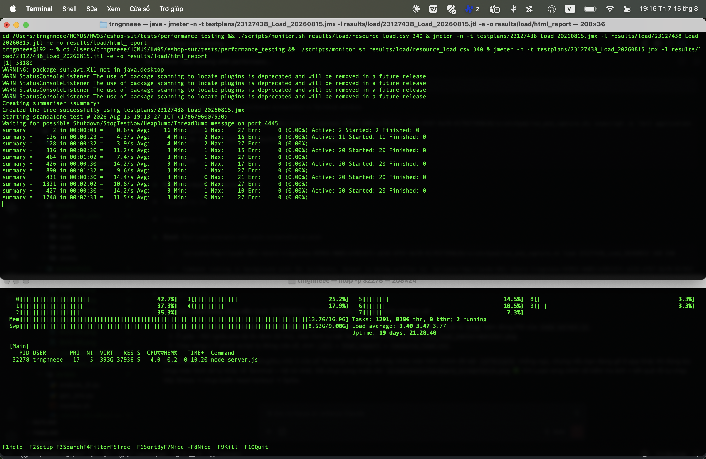

# PERF-LOAD-01: Load test — Category-guided buy (20 VU / 5 phút)

## Requirement ID
HW05 Task 1 — Load testing; workflow phủ 3 nhóm endpoint (auth-heavy, read-heavy, transactional)

## Module / Test type / Technique
Backend API (EShop) / Performance — Load Testing / JMeter 5.6.3 (non-GUI), data-driven CSV

## Testcase coverage
| Thuộc tính | Giá trị |
| :--- | :--- |
| Testcase ID | PERF-LOAD-01 |
| Scenario type | Load (tải bình thường / baseline) |
| Actor | Virtual User đã có tài khoản (pool `nguyen01..60`) |
| Goal | Đo baseline p95/throughput của workflow Category-guided buy ở tải ngày thường. |
| Endpoint(s) | `POST /api/login` → `GET /api/categories` → `GET /api/products?search=` → `POST /api/cart` → `POST /api/checkout` |
| Endpoint groups | Auth-heavy + Read-heavy + Transactional |
| Test plan | `testplans/23127438_Load_20260815.jmx` (listener: Summary Report) |
| Traced to | Đề HW05 §6 Task 1 — Load; quy ước nhóm workflow #3 |

## Preconditions
- Backend chạy tại `localhost:3000` (`node server.js`), DB đã seed.
- User pool 60 tài khoản `nguyen01..60@eshop.com` đã đăng ký; `login_attempts=0` (không bị lockout).
- CSV `testplans/nguyen_users.csv` sẵn sàng; keyword search khớp tên seed (không rỗng).

## Test data
| Tham số | Giá trị thử nghiệm |
| :--- | :--- |
| Threads (VU) | 20 |
| Ramp-up | 60s |
| Duration | 300s (5 phút) |
| Think-time | login/categories 1–2s, search 1–3s, cart/checkout ~1s |
| CSV | `nguyen_users.csv` (60 dòng, recycle) |
| Listener | Summary Report + raw `.jtl` + HTML dashboard |

## Test steps
1. Reset lockout: `sqlite3 eshop-sut/backend/database.sqlite "UPDATE users SET login_attempts=0, locked_until=NULL;"`.
2. Bật monitor tài nguyên: `./scripts/monitor.sh results/load/resource_load.csv 340 &`.
3. Chạy: `jmeter -n -t testplans/23127438_Load_20260815.jmx -l results/load/23127438_Load_20260815.jtl -e -o results/load/html_report`.
4. Phân tích: `python3 scripts/analyze_jtl.py results/load/23127438_Load_20260815.jtl`.

## Expected result
- Error rate = 0% (mọi request pass content-assertion: `token`, categories array, search có kết quả, `Added to cart`, `orderId`).
- p95 latency ổn định ở mức thấp (baseline, < 50ms trên phần cứng mục tiêu).
- Backend không crash; CPU/RAM node ở mức thấp, có nhiều dư địa.

## Status / Related bugs
Passed — 0 lỗi chức năng trong happy path. Các vấn đề phát hiện qua đọc source/probe: xem `docs/bug_report.md` (BUG-1 lockout sai spec, BUG-2 SQLi ở search…).

## Actual result
- Executed by: Đặng Trường Nguyên
- Execution date: 2026-08-15
- Execution interface: JMeter 5.6.3 non-GUI + htop (bám PID node backend), máy Apple M4 / 16GB / macOS 15.5
- Execution time: 19:13–19:18 ICT
- Observed:
  - Samples: **3,833** | Error: **0 (0.00%)** | Throughput: **12.84 req/s** | Wall: 298s
  - Latency (ms): mean 3.2 | p90 6 | **p95 7** | p99 8 | max 27
  - Per-request p95: login 5 · categories 4 · search 4 · cart 4 · **checkout 8** (nặng nhất — ghi đĩa `INSERT orders`)
  - Node backend: CPU đỉnh **5.5%** · RSS đỉnh **47 MB**
- Execution result: **Passed**
- Evidence: `results/load/23127438_Load_20260815.jtl`, `results/load/html_report/`, `results/load/resource_load.csv`, `screenshots/report_load.png`
- Screenshot:  — JMeter đang chạy (Active: 20, Err 0%) + htop process `node server.js`, chụp tại t≈160s
