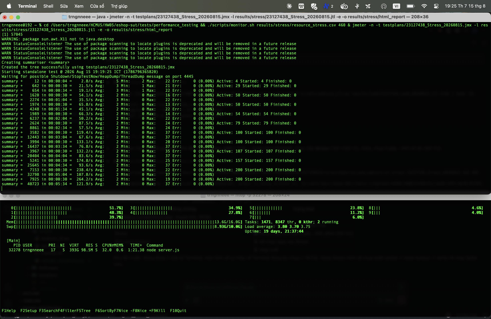

# PERF-STRESS-01: Stress test — Category-guided buy (50→100→200 VU bậc thang)

## Requirement ID
HW05 Task 1 — Stress testing; tìm breaking point của workflow phủ 3 nhóm endpoint

## Module / Test type / Technique
Backend API (EShop) / Performance — Stress Testing / JMeter 5.6.3 (non-GUI), data-driven CSV

## Testcase coverage
| Thuộc tính | Giá trị |
| :--- | :--- |
| Testcase ID | PERF-STRESS-01 |
| Scenario type | Stress (tăng tải bậc thang tới điểm gãy) |
| Actor | Virtual User đã có tài khoản (pool `nguyen01..60`) |
| Goal | Đẩy tải tăng dần 50→100→200 VU để định vị breaking point và ngưỡng suy giảm. |
| Endpoint(s) | `POST /api/login` → `GET /api/categories` → `GET /api/products?search=` → `POST /api/cart` → `POST /api/checkout` |
| Endpoint groups | Auth-heavy + Read-heavy + Transactional |
| Test plan | `testplans/23127438_Stress_20260815.jmx` (listener: Aggregate Report) |
| Traced to | Đề HW05 §6 Task 1 — Stress; quy ước nhóm workflow #3 |

## Preconditions
- Backend chạy tại `localhost:3000`, DB đã seed.
- User pool 60 tài khoản đã đăng ký; **lockout đã reset ngay trước run** (SQL).
- CSV recycle để 200 VU luân phiên qua 60 bộ dữ liệu.

## Test data
| Tham số | Giá trị thử nghiệm |
| :--- | :--- |
| Threads (VU) | Bậc thang: 50 (t=0) → +50 (t=120s) → +100 (t=240s) = **200 đỉnh** |
| Ramp-up | 60s mỗi bậc |
| Duration | ~420s (7 phút) |
| Think-time | ~0.5–1s (dồn tải) |
| CSV | `nguyen_users.csv` (60 dòng, recycle) |
| Listener | Aggregate Report + raw `.jtl` + HTML dashboard |

## Test steps
1. Reset lockout: `sqlite3 ... "UPDATE users SET login_attempts=0, locked_until=NULL;"`.
2. Monitor: `./scripts/monitor.sh results/stress/resource_stress.csv 460 &`.
3. Chạy: `jmeter -n -t testplans/23127438_Stress_20260815.jmx -l results/stress/23127438_Stress_20260815.jtl -e -o results/stress/html_report`.
4. Phân tích: `python3 scripts/analyze_jtl.py results/stress/23127438_Stress_20260815.jtl`.

## Expected result
- Xác định được breaking point (mức VU/RPS mà error-rate tăng vọt hoặc p95 vượt ngưỡng), HOẶC ghi nhận hệ vẫn ổn định trong toàn dải test.
- Không crash backend; theo dõi CPU/RAM leo theo bậc tải.

## Status / Related bugs
Passed — hệ ổn định tới 200 VU, **chưa chạm breaking point**; 0 lỗi. Không phát sinh bug chức năng mới trong run.

## Actual result
- Executed by: Đặng Trường Nguyên
- Execution date: 2026-08-15
- Execution interface: JMeter 5.6.3 non-GUI + htop (bám PID node backend), máy Apple M4 / 16GB / macOS 15.5
- Execution time: 19:19–19:26 ICT (lockout reset trước run)
- Observed:
  - Samples: **63,398** | Error: **0 (0.00%)** | Throughput: **151.20 req/s** (đỉnh 200 VU) | Wall: 419s
  - Latency (ms): mean 2.6 | p90 5 | **p95 7** | p99 11 | max 51
  - Per-request p95: login 6 · categories 5 · search 5 · cart 3 · **checkout 9**
  - Node backend: CPU đỉnh **41.6%** · RSS đỉnh **102 MB**
  - **Kết luận:** breaking point nằm **> 200 VU / > 151 req/s** — trên phần cứng M4, SUT (Node + SQLite in-process) chưa phải nút cổ chai; giới hạn thực tế là think-time và khả năng sinh thread của JMeter 1 máy.
- Execution result: **Passed**
- Evidence: `results/stress/23127438_Stress_20260815.jtl`, `results/stress/html_report/`, `results/stress/resource_stress.csv`, `screenshots/report_stress.png`
- Screenshot:  — chụp tại t≈345s, Active: 200, throughput tức thời 264 req/s, node 32% CPU
